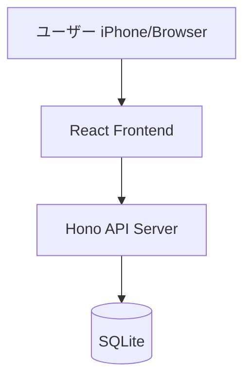

# STEP 3: アーキテクチャ設計（エンジニア）

**目的**: 全体構成を決定し、技術選定のトレードオフを記録する。

## 実施内容

### システム構成図（Mermaid）


### 技術スタック確認
- Frontend: React + TypeScript
- Backend: Hono
- DB: SQLite
- Hosting: TBD

### ディレクトリ構成案
```
src/
├── client/       # React フロントエンド
├── server/       # Hono バックエンド
├── shared/       # 型定義（共有）
└── db/           # スキーマ・マイグレーション
```

### API設計（エンドポイント一覧）
| Method | Path | 説明 |
|--------|------|------|
| GET | /api/session | セッション用単語10件取得 |
| POST | /api/review | 自己評価（Good/Again）を記録 |
| ... | ... | ... |

### 技術選定の根拠（必須）
- なぜAではなくBを選んだかを記載する

## 出力先
`docs/spec/design/architecture.md`
