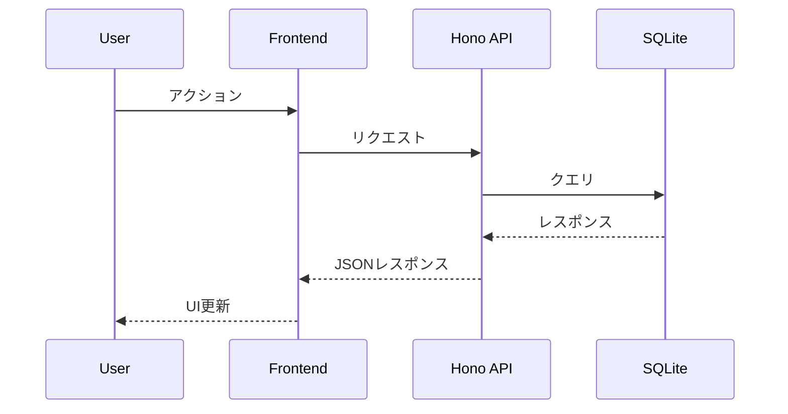
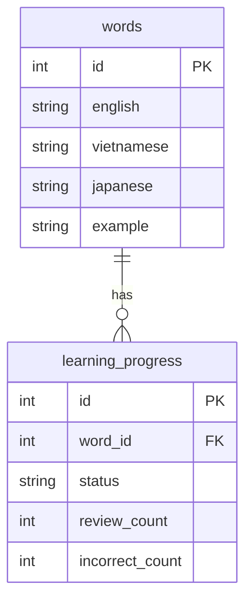

# STEP 4: 詳細設計 + シーケンス図（エンジニア）

**目的**: 各機能の動作を図で明確化し、実装前の認識合わせを行う。

## 実施内容

### シーケンス図（Mermaid）— 必須

### データモデル（ERD）

### 画面遷移図
- ワイヤーフレームが存在する場合は参照する
- 主要な遷移パターンを図示する

### エラーハンドリング設計
- 各APIエンドポイントのエラーケースを列挙する
- フロントエンドでのフォールバック動作を定義する

## 出力先
機能ごとに `docs/spec/design/[feature-name].md`
- 例: `docs/spec/design/flashcard.md`
- 例: `docs/spec/design/word-list.md`
- 例: `docs/spec/design/admin.md`
