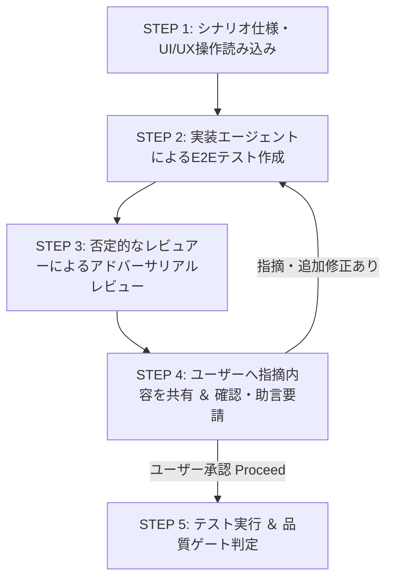

# SKILL: Test E2E (E2Eテスト作成 ＆ 敵対的レビュー)

## 概要
`docs/test/` のテスト戦略・計画書に沿って、ユーザーシナリオ E2E テスト (Playwright) を作成・強化するスキル。
「テスト実装エージェント」と「批判的・否定的なテストレビュアーエージェント」がペアで動き、ユーザーにレビュー指摘を共有して合意を得ながら高品質なE2Eテストを完成させる。

## 起動方法
```
/test-e2e [対象シナリオまたは画面]
```
- 例: `/test-e2e src/client/pages/StudyPage.tsx`
- 例: `/test-e2e auth-and-study-flow`

---

## ワークフロー (実行手順)



### STEP 1: シナリオ仕様・UI/UX操作の読み込み
- `docs/test/README.md` および `docs/test/test-plan.md` を確認。
- ユーザー操作シナリオ（ログイン → 音声解錠スタートボタン → カードめくり → スワイプ/Good/Again → Undo → リザルト交代）を解析。

### STEP 2: テスト実装エージェントによるテスト作成
- ペルソナ `.agents/skills/test-e2e/agent/persona-implementer.md` を確立。
- 対象に対する E2E テストコード (`*.spec.ts`) を Playwright のアクセシブルクエリ (`getByRole`, `getByText`) で書き下ろす/修正する。

### STEP 3: 批判的・否定的なレビュアーによるレビュー
- ペルソナ `.agents/skills/test-e2e/agent/persona-reviewer.md` を確立。
- あえて否定的な視点から E2E テストを検証し、以下の弱点を抽出する：
  1. 壊れやすいセレクタ（CSSクラスハッシュやXPathへの依存）
  2. 非同期アニメーション・トースト・音声解錠の待機不足（Flakyリスク）
  3. モバイル端末表示・タッチ/スワイプ動作の未検証
  4. レスポンシブ・ビューポート依存による破綻リスク

### STEP 4: ユーザーへのレビュー結果共有 ＆ 対話ループ (対話ヒアリング)
- **【重要】** レビュアーの否定的な指摘・改善提案をユーザーに分かりやすく箇条書きで提示する。
- ユーザーに **「この指摘内容で修正を進めてよいか、さらなる指摘やご助言はあるか」** を質問する。
  - ユーザーから追加の指摘・修正要請があった場合 ➡️ **STEP 2 に戻り、テスト実装エージェントが再修正。**
  - ユーザーから承認を得た場合 ➡️ **STEP 5 に進む。**

### STEP 5: テスト実行 ＆ 品質ゲート確認
- テストコマンドを実行し、すべて PASS することを確認。
- `.agents/skills/test-e2e/rules/quality-gate.md` を完了。
