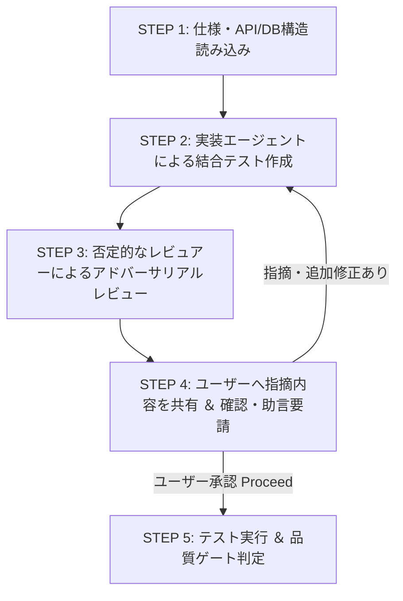

# SKILL: Test Int (結合・統合テスト作成 ＆ 敵対的レビュー)

## 概要
`docs/test/` のテスト戦略・計画書に沿って、API・DB・セキュリティの結合テスト (Vitest / Supertest) を作成・強化するスキル。
「テスト実装エージェント」と「批判的・否定的なテストレビュアーエージェント」がペアで動き、ユーザーにレビュー指摘を共有して合意を得ながら高品質な結合テストを完成させる。

## 起動方法
```
/test-int [対象APIまたはルート]
```
- 例: `/test-int src/server/routes/users.ts`
- 例: `/test-int src/server/routes/review.ts`

---

## ワークフロー (実行手順)



### STEP 1: 仕様・API/DB構造の読み込み
- `docs/test/README.md` および `docs/test/test-plan.md` を確認。
- 対象となる Hono ルート、認証ミドルウェア、DBスキーマ（Repository）の動作条件を解析。

### STEP 2: テスト実装エージェントによるテスト作成
- ペルソナ `.agents/skills/test-int/agent/persona-implementer.md` を確立。
- 対象に対する結合テストコード (`*.test.ts` / `*.spec.ts`) を書き下ろす/修正する。

### STEP 3: 批判的・否定的なレビュアーによるレビュー
- ペルソナ `.agents/skills/test-int/agent/persona-reviewer.md` を確立。
- あえて否定的な視点から結合テストを検証し、以下の弱点を抽出する：
  1. 未認証アクセスでの情報漏洩（ユーザー列挙攻撃）やトークン偽造に対する防御テスト漏れ
  2. HTTPエラーコード（400, 401, 403, 409）およびエラーメッセージの型検証の甘さ
  3. DB状態のクリーンアップ漏れ・テスト間干渉
  4. トランザクション・ロールバック境界の未検証

### STEP 4: ユーザーへのレビュー結果共有 ＆ 対話ループ (対話ヒアリング)
- **【重要】** レビュアーの否定的な指摘・改善提案をユーザーに分かりやすく箇条書きで提示する。
- ユーザーに **「この指摘内容で修正を進めてよいか、さらなる指摘やご助言はあるか」** を質問する。
  - ユーザーから追加の指摘・修正要請があった場合 ➡️ **STEP 2 に戻り、テスト実装エージェントが再修正。**
  - ユーザーから承認を得た場合 ➡️ **STEP 5 に進む。**

### STEP 5: テスト実行 ＆ 品質ゲート確認
- テストコマンドを実行し、すべて PASS することを確認。
- `.agents/skills/test-int/rules/quality-gate.md` を完了。
