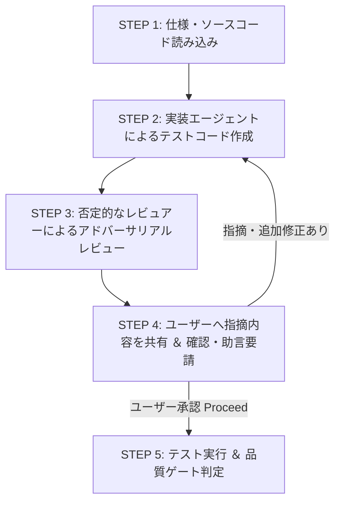

# SKILL: Test Unit (単体テスト作成 ＆ 敵対的レビュー)

## 概要
`docs/test/` のテスト戦略・計画書に沿って、単体テスト (Vitest) を作成・強化するスキル。
「テスト実装エージェント」と「批判的・否定的なテストレビュアーエージェント」がペアで動き、ユーザーにレビュー指摘を共有して合意を得ながら高品質な単体テストを完成させる。

## 起動方法
```
/test-unit [対象ファイルまたはモジュール]
```
- 例: `/test-unit src/client/hooks/useSession.ts`
- 例: `/test-unit src/client/lib/sfx.ts`

---

## ワークフロー (実行手順)



### STEP 1: 仕様・コードの読み込み
- `docs/test/README.md` および `docs/test/test-plan.md` を確認。
- 対象となるソースコード（関数の挙動、境界値、状態変化）を解析。

### STEP 2: テスト実装エージェントによるテスト作成
- ペルソナ `.agents/skills/test-unit/agent/persona-implementer.md` を確立。
- 対象に対する単体テストコード (`*.test.ts`) を Vitest の AAA パターンで書き下ろす/修正する。

### STEP 3: 批判的・否定的なレビュアーによるレビュー
- ペルソナ `.agents/skills/test-unit/agent/persona-reviewer.md` を確立。
- あえてあまのじゃく・批判的な視点からテストを検証し、以下の弱点を抽出する：
  1. 境界値（0, null, 負数, 上限値）のアサーション漏れ
  2. お茶を濁した大雑把な `toBeTruthy()` 等のアサーションの甘さ
  3. 非同期タイマー処理の Flaky さ
  4. モック依存の過多（モックをテストしているだけの状態）

### STEP 4: ユーザーへのレビュー結果共有 ＆ 対話ループ (対話ヒアリング)
- **【重要】** レビュアーの否定的な指摘・改善提案をユーザーに分かりやすく箇条書きで提示する。
- ユーザーに **「この指摘内容で修正を進めてよいか、さらなる指摘やご助言はあるか」** を質問する。
  - ユーザーから追加の指摘・修正要請があった場合 ➡️ **STEP 2 に戻り、テスト実装エージェントが再修正。**
  - ユーザーから承認を得た場合 ➡️ **STEP 5 に進む。**

### STEP 5: テスト実行 ＆ 品質ゲート確認
- テストコマンド (`npx vitest run ...`) を実行し、すべて PASS することを確認。
- `.agents/skills/test-unit/rules/quality-gate.md` を完了。
