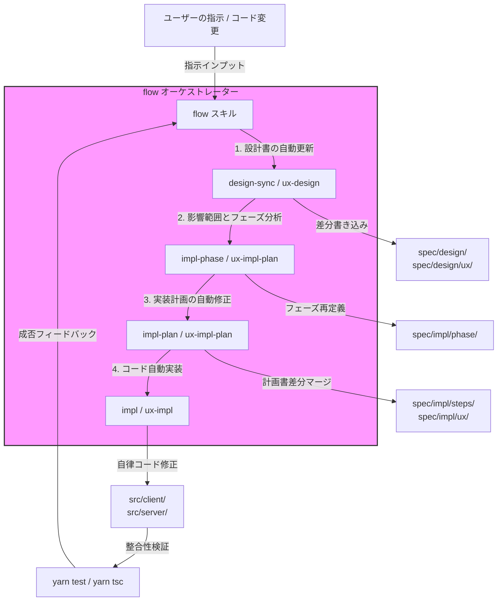
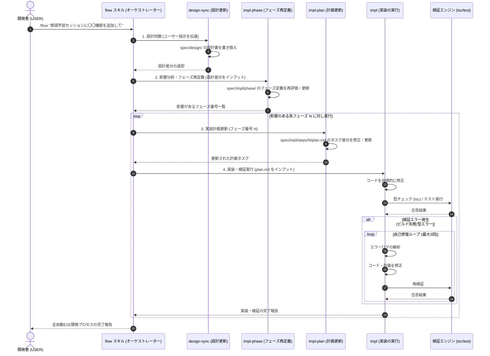

# 設計ドキュメント: 自律型開発オーケストレーター (flow)

## 1. プロダクト背景と目的 (STEP 1)

### ユーザーストーリー

* **開発プロセスの全自動連携 (E2Eオーケストレーション)**
  * **As a** AIペアプログラミングを行う開発者、
  * **I want to** 「〇〇の機能を変更したい」「このUI/UXを追加して」とチャットで指示するだけで、設計書の更新、フェーズ定義の再評価、実装計画書の自動更新、コード実装、およびテスト検証が全自動で連鎖して実行されてほしい、
  * **So that** `/design` -> `/impl-phase` -> `/impl-plan` -> `/impl` などの多数のコマンドを毎回手動で順番に実行し、進捗や整合性を管理する手間を完全に排除し、本質的なプロダクト設計とアイデアの創出に集中したい。

### ターゲットユーザー（ペルソナ）

1. **AIファーストの開発者 (USER)**
   * AIエージェント（Antigravity等）とペアプログラミングを行い、対話ベースで高速にプロダクトを立ち上げ・改善している開発者。
   * 技術リテラシー：極めて高い（コードやアーキテクチャの構造を理解している）。
   * 場面：機能追加、仕様変更、UI/UXのブラッシュアップを繰り返し、素早くプロダクトを反復開発したい局面。

### 解決するペインポイント

* **コマンドの手動連続実行によるオーバーヘッド**
  * 現状のスキル群（`/design`, `/impl-phase`, `/impl-plan`, `/impl`）はそれぞれ独立して動作するため、設計変更のたびに人間が次のステップのコマンドを手動で起動してあげる必要があり、開発のテンポが損なわれる。
* **設計変更による影響範囲の特定漏れ**
  * 設計書の一部を変更した際、どのフェーズ（`phase-N.md`）やどの実装計画（`steps/N/plan.md`）、どの実装コードが影響を受けるかを人間やエージェントがその都度推測しなければならず、実装計画やコードに修正漏れや不整合が発生しやすい。
* **計画書（plan.md）とコードの不整合**
  * コードを直接修正した際、設計書や実装計画書（`plan.md`）の更新が忘れられがちになり、ドキュメントとコードの乖離（技術負債）が生じる。

### 成功指標 (KPI)

* **開発サイクルの手動介入「ゼロ」化**:
  * 設計の変更指示からコード修正・検証の完了までの間に、ユーザーによる追加のスキル起動コマンド（例: `/impl` の再実行指示など）の入力回数を **0回** にする（1つの統合コマンド `/flow` の起動のみで完了する）。
* **整合性担保**:
  * 実行後、`spec/design/`、`spec/impl/phase/`、`spec/impl/steps/` の各ドキュメントと実際のコードが100%整合している状態を自動で作り上げる。

---

## 2. 要件定義 (STEP 2)

### 機能要件 (MoSCoW法による優先度付け)

#### **Must have** (必須機能)
1. **統合起動コマンド `/flow [変更指示]` の提供**
   * ユーザーからの自然言語での指示を起点に、全体のパイプラインを実行する。
2. **設計書の自動アップデート (`/design` の拡張・実行)**
   * 指示内容を分析し、`spec/design/` (および UI/UX に関するものは `spec/design/ux/`) 内の該当する設計ドキュメントを書き換える。
3. **影響範囲の自動分析 (Impact Assessment)**
   * 設計書の差分を元に、どの実装フェーズ（`phase-N.md`）およびどの実装計画（`plan.md`）に影響があるかを特定する。
4. **実装計画の自動差分更新 (`/impl-plan` の拡張・実行)**
   * 影響を受けるすべての実装計画（`spec/impl/steps/<番号>/plan.md`）に対して、タスクや受け入れ基準を自動で追加・更新する。
5. **コード実装と検証の自動実行 (`/impl` の拡張・実行)**
   * 更新された実装計画書に沿って、関連するソースコードを自律的に修正し、自動テストやビルド（型チェック `tsc`）を実行して整合性を確認する。
6. **進捗のリアルタイム可視化**
   * 「設計書更新中...」「実装計画修正中...」といった、現在のパイプラインのフェーズと進行状況をユーザーにわかりやすく表示する。
7. **開発履歴の自動記録**
   * 実行のたびに、どの設計・計画・コードを変更し、どう検証したかのステップ履歴を `spec/agent/flow-history.md` に自動で記録・追記する。

#### **Should have** (推奨機能)
1. **手動コード差分からの設計書リバースアップデート**
   * ユーザーが手動で行ったコードの変更（git diff）から、自動的に設計書へその内容を逆反映する（`/flow --reverse` など）。
2. **ステップごとの承認ゲート (Interactive Approval)**
   * 「設計書の書き換えが完了しました。この内容で実装計画の修正に進んでよろしいですか？」とユーザーに確認を求め、許可を得てから次へ進む対話モード。

#### **Could have** (あれば望ましい機能)
1. **視覚的ステータス管理ボードの自動生成**
   * 現在の全フェーズの実装・検証状況を、MarkdownテーブルやMermaid図でアーティファクトに出力し、ユーザーが進行状況をリアルタイムでグラフィカルに把握できるようにする。

#### **Won't have** (スコープ外)
1. **CI/CDや本番環境への自動デプロイ**
   * あくまでローカルリポジトリ上でのコード修正・ビルド検証完了までをスコープとする。
2. **別ターミナルや並列エージェントでの並行処理**
   * デバッグの複雑化やファイル書き込み競合を避けるため、1つのエージェントインスタンスが同期的に順を追って実行する。

### 非機能要件

* **型安全と動作保証**:
  * コード修正実行後は必ず TypeScript の型チェック (`yarn tsc` または相当するコマンド) およびビルドを行い、エラーがないことを確認すること。
* **コンテキストおよびトークンの最適化**:
  * 設計・計画・実装の全工程を一度に行うため、コンテキストウィンドウが肥大化しやすい。必要に応じてサブエージェント（`self` や `research`）に処理を適切に委譲し、各ステップで必要なコンテキストのみを読み込む設計にする。
* **堅牢なロールバック機構**:
  * 実装ステップでテストやビルドが通らない場合、その場でコードや計画を再修正する自己修復ループを最大N回回す。それでも失敗した場合は、git で直前のクリーンな状態にロールバックし、ユーザーにエラーを報告する。

---

## 3. アーキテクチャ設計 (STEP 3)

### システム連携図

`flow` スキルは、既存の設計・計画・実装の各スキルを統合制御し、ドキュメントとコードの同期を自動実行するオーケストレーターとして動作します。



### スキルのディレクトリ構成案

新しく `.agents/skills/flow/` を作成し、そこにオーケストレーション実行用の定義とルールをまとめます。

```
.agents/skills/flow/
├── SKILL.md                  # スキル定義（本オーケストレータの起動・全体像）
├── references/
│   ├── agent/
│   │   └── persona.md        # オーケストレータ専用ペルソナ（統合開発調整者）
│   └── rules/
│       └── flow-rules.md     # 実行ルール・安全制御・自己修復ポリシー
└── skills/
    ├── step1-design-sync.md   # STEP 1: ユーザー指示に基づく設計書の自動更新ステップ
    ├── step2-phase-sync.md    # STEP 2: フェーズ定義・影響範囲分析ステップ
    ├── step3-plan-sync.md     # STEP 3: 実装計画書（plan.md）の差分修正ステップ
    └── step4-impl-sync.md     # STEP 4: 実装実行・テスト・検証自動化ステップ
```

### 技術選定の根拠

1. **既存スキル（design / impl 等）の自律的チェーン化**
   * 各スキル（`/design`, `/impl` 等）は、それぞれに特化した「ペルソナ」や「品質ゲート」を定義しています。新スキル `/flow` はこれらを統合し、前段の出力を次段の入力へ自動的にバイパスする「コンパイラ」のような挙動をとります。これにより、既存のスキル資産を破壊することなく、シームレスな連続稼働を実現します。
2. **状態・差分の追跡方法**
   * どの設計ファイルやコードが変更されたかは、主に `git diff` を一時的に取得して追跡します。DBなどの外部ミドルウェアを使用せず、Gitとファイルシステムの差分にのみ依存することで、軽量かつ信頼性の高い状態管理を行います。
3. **自己修復（自己修正）ループの導入**
   * 実装フェーズで `tsc` やテストが失敗した場合にすぐ終了するのではなく、エラーログ自体をエージェントにフィードバックし、計画や実装を最大3回まで再帰的に修正するループを設けます。これにより、微細なシンタックスエラーやインポート漏れを自立的に解消し、完遂率を劇的に向上させます。

---

## 4. 詳細設計 (STEP 4)

### 処理プロセスシーケンス



### エラーハンドリングおよびフォールバック設計

| エラー発生ポイント | 想定されるエラー原因 | フォールバック・動作仕様 |
|------------------|--------------------|-------------------------|
| **1. 設計書更新時** | ユーザーの指示が曖昧で、既存設計のどこを修正すればよいか判断できない。 | 無理に更新せず、チャットにてユーザーに具体的な挙動や仕様の確認（対話）を行い、明確になってから再実行する。 |
| **2. 実装計画更新時** | 計画書（`plan.md`）の形式が崩れている、または前後のタスク依存性がループしている。 | バックアップ（または Git の直前コミット）から前バージョンの `plan.md` を復元し、タスク構成を再生成する。 |
| **3. 実装コード検証時** | コード変更後に `tsc` （型チェック）やテストが通らない（自己修復ループが失敗）。 | 1. 修正されたファイルを Git の最新コミット状態にロールバック (`git checkout -- <file>`) する。<br>2. 失敗したエラーログと影響箇所を保存し、「Phase <N> の実装自動化に失敗しました。以下の型エラーが発生しています...」とユーザーに報告し、手動修正へ引き継ぐ。 |
| **4. 処理の中断要求** | ユーザーが実行中に処理を明示的に止めたい（キャンセル）。 | `manage_task` にてタスクを `kill` された場合、あるいはエージェントへの中断指示がきた場合、編集中のファイルを安全に保存して現在地を報告し、停止する。 |

---

## 5. リスク評価 (STEP 5)

### リスクマトリクス

| リスク | 影響度 | 発生確率 | 対策 |
|--------|--------|----------|------|
| **コンテキスト肥大化によるエージェントの混乱** | 高 | 高 | 処理をサブエージェント（`self` や `research`）や各工程の専用エージェント（`/design`, `/impl` 等）に適切に委譲し、本流のオーケストレーターは状態移行と意思決定のみに徹する。 |
| **自動修正（自己修復）ループの無限実行** | 中 | 中 | 自己修復の試行回数を最大 **3回** に制限し、回数を超えた場合は処理を打ち切って直前のクリーンな状態にロールバックする。 |
| **不適切なコード生成による広範囲の破壊** | 高 | 中 | 1. 起動時に `git status` がクリーンであることを確認（汚れている場合は事前にコミットやスタッシュを促す）。<br>2. 処理失敗時は `git reset --hard` または `git checkout --` により確実に元の状態へロールバック可能な状態で実行する。 |
| **設計と実装の無限デッドロック（手戻りループ）** | 中 | 低 | 設計を変更した結果、実装不可能な構造になり、設計の自動修正と実装の自動修正の間でループが発生する場合、エラー検出時に自動実行を一時停止し、ユーザーに設計上の矛盾を報告して指示を仰ぐ。 |

* **影響度・発生確率の定義**:
  * **高**: プロジェクトの成功やコードの健全性に重大な影響を与える。
  * **中**: 対処しないと品質の低下、あるいは実行時間・トークンの著しい浪費に繋がる。
  * **低**: 許容範囲または簡単なハンドリングで回避可能。

---

## 6. 受け入れ基準 (STEP 6)

### 機能名: 自律型開発オーケストレーター (flow)

* **AC1: 統合パイプラインの起動**
  * ユーザーが `/flow "[指示内容]"` を実行した際、エージェントが指示を解釈し、全体の自律連携処理（設計 -> フェーズ定義 -> 実装計画 -> 実装 -> 検証）を開始するメッセージを表示すること。
* **AC2: 設計ドキュメントの自動アップデート**
  * 指示内容から影響を受ける設計書（`spec/design/` または `spec/design/ux/`）が特定され、指示を反映した内容（差分）に自動で更新されること。
* **AC3: フェーズおよび実装計画書の自動更新**
  * 設計変更に追従して、影響のあるフェーズ定義（`spec/impl/phase/`）および各フェーズの実装計画書（`spec/impl/steps/<番号>/plan.md`）のタスクや受け入れ基準が自動で追加・更新されること。
* **AC4: コードの自動修正とビルド検証**
  * 更新された `plan.md` に基づき、該当するソースコードが自律的に修正され、その後に `yarn tsc` (型チェック) および自動テストが実行され、すべてパスすること。
* **AC5: エラー発生時の自己修復**
  * コード修正後のビルドやテストでエラーが発生した際、エラーログをエージェント自身で読み込んで解析し、最大3回まで再修正と再テストを試みること。
* **AC6: ロールバックとエラー通知**
  * 3回の自己修復を試みても検証が通らない場合、そのフェーズで変更したコードを Git の実行直前のクリーンな状態に自動でロールバックし、エラーの詳細とロールバック結果をユーザーに報告すること。
* **AC7: 手動コード差分の逆同期 (Should Have)**
  * `/flow --reverse` を実行した際、git diff を解析して直近の手動変更内容を設計書（`spec/design/`）に自動で逆反映し、整合性を保つこと。


