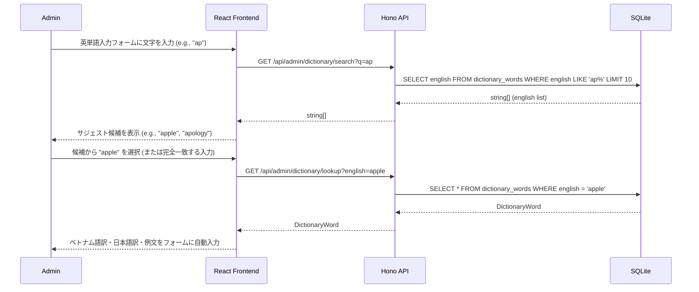
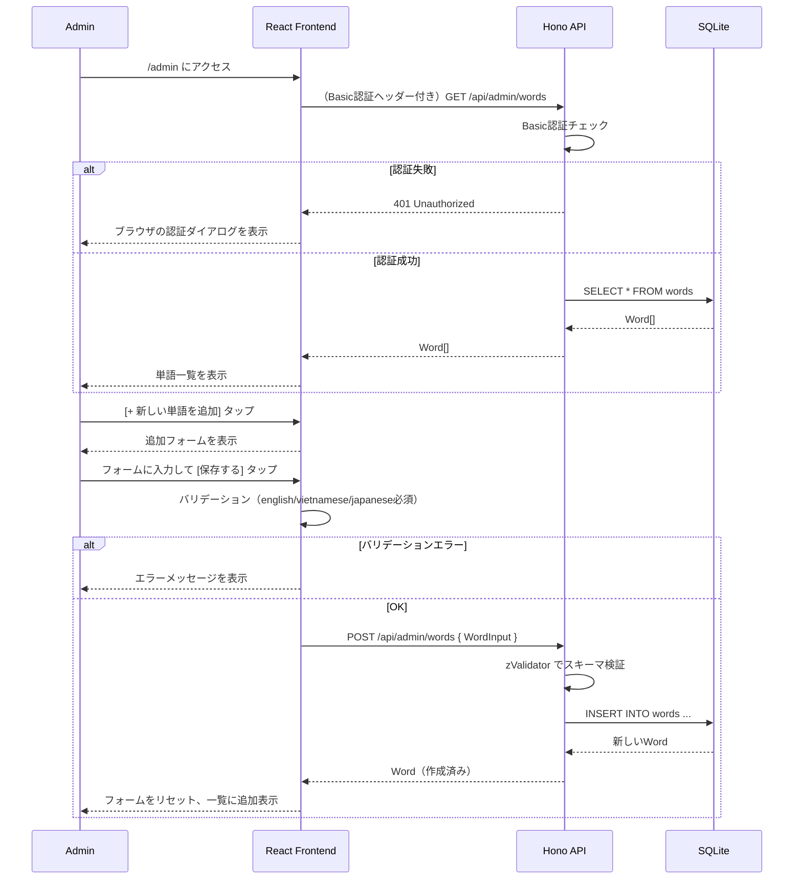
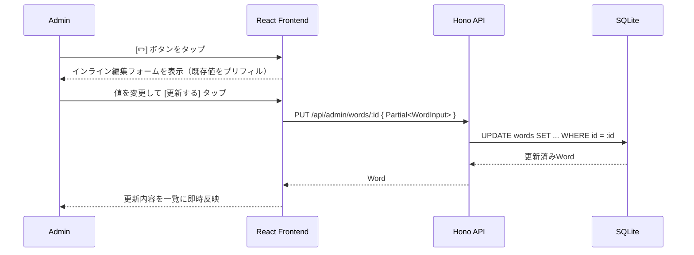
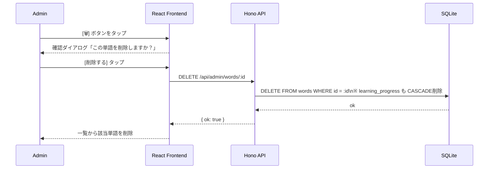

# 管理機能（単語CRUD）詳細設計

## 概要

管理者（パートナー）がスマホから単語を追加・編集・削除できる管理画面。  
HonoのBasic認証でアクセス保護する。URLは `/admin` 。  
シンプルなフォームUIで、難しい操作なく単語を管理できる。

---

## 画面レイアウト（ワイヤーフレーム）

```
+------------------------------------------+
| 🔑 管理画面                   [← 学習へ]  |
+------------------------------------------+
| [+ 新しい単語を追加]                       |  ← 追加フォームを展開するボタン
+------------------------------------------+
|                                           |
|  ▼ 単語追加フォーム（展開時）              |
|  +--------------------------------------+|
|  |  英単語 *       [ apple           ] ||
|  |  ベトナム語訳 *  [ quả táo         ] ||
|  |  日本語訳 *     [ りんご           ] ||
|  |  英語例文       [ I ate an apple.  ] ||
|  |  例文(VN)       [ Tôi đã ăn ...   ] ||
|  |  例文(JP)       [ 私はりんごを...   ] ||
|  |                          [保存する]  ||
|  +--------------------------------------+|
|                                           |
+------------------------------------------+
|  単語一覧（管理用）                        |
|  +--------------------------------------+|
|  |  apple          🟡 new  [✏️] [🗑]  ||
|  +--------------------------------------+|
|  |  beautiful      🔴 weak  [✏️] [🗑]  ||
|  +--------------------------------------+|
|  （以下続く）                             |
+------------------------------------------+
```

---

## シーケンス図 — 辞書からの自動プレフィル



---

## シーケンス図 — 単語追加



---

## シーケンス図 — 単語編集



---

## シーケンス図 — 単語削除



---

## バリデーション仕様（zValidator）

```typescript
import { z } from 'zod';

export const WordInputSchema = z.object({
  english:     z.string().min(1, '英単語は必須です').max(100),
  vietnamese:  z.string().min(1, 'ベトナム語訳は必須です').max(200),
  japanese:    z.string().min(1, '日本語訳は必須です').max(200),
  example_en:  z.string().max(500).optional().nullable(),
  example_vi:  z.string().max(500).optional().nullable(),
  example_ja:  z.string().max(500).optional().nullable(),
});
```

---

## Basic認証設定

```typescript
// server/routes/admin.ts
import { basicAuth } from 'hono/basic-auth';

adminRoutes.use('*', basicAuth({
  username: Bun.env.ADMIN_USER ?? 'admin',
  password: Bun.env.ADMIN_PASS ?? 'changeme',
}));
```

> 環境変数 `ADMIN_USER` / `ADMIN_PASS` で認証情報を設定する。  
> デフォルト値はローカル開発用のみ。本番環境では必ず変更すること。

---

## エラーハンドリング

| エラー | フロントエンドの動作 |
|--------|---------------------|
| 401 Unauthorized | ブラウザのBasic認証ダイアログを表示（ブラウザ標準動作） |
| バリデーションエラー | 各フィールドの下にエラーメッセージを赤字で表示 |
| POST/PUT/DELETE 失敗 | 「操作に失敗しました。再試行してください」をトースト表示 |
| 存在しないIDへのPUT/DELETE | 「単語が見つかりません」を表示 |

---

## 受け入れ基準（Acceptance Criteria）

```
機能名: 単語管理（CRUD）

AC1: アプリ起動時のユーザー選択画面（/users）のフッター領域に、管理画面（/admin）へのリンク（Dành cho Admin / 管理者向け設定）が配置されていること。
     /admin にアクセスすると認証フォームが表示されること。
     ログインに成功すると、ローカルストレージに資格情報が保存され、管理画面に自動遷移すること。
     ログインに失敗した場合は、エラーメッセージが表示されること。

AC2: 管理画面に現在登録されている全単語の一覧が表示されること。
     各行に 英単語・学習ステータス・編集ボタン・削除ボタン が表示されること。

AC3: [+ 新しい単語を追加] をタップするとフォームが表示されること。
     english/vietnamese/japanese/word_set_id は必須項目で、未入力のまま保存するとエラーメッセージが表示されること。
     単語セット（ランク：Basic / Intermediate / Advanced）が選択できること。

AC4: フォームに全必須項目を入力して [保存する] をタップすると、
     POST /api/admin/words が実行され、単語一覧の先頭に新しい単語が追加されること。

AC5: [✏️] をタップするとインライン編集フォームが表示され、
     単語セットの変更を含めて [更新する] で PUT /api/admin/words/:id が実行され、
     一覧の内容が即座に更新されること。

AC6: [🗑] をタップすると確認ダイアログが表示され、
     [削除する] で DELETE /api/admin/words/:id が実行され、
     一覧から該当単語が削除されること。
     キャンセルすると削除されないこと。

AC7: 単語一覧で、単語セット（ランク）を選択して絞り込んで表示（フィルタ）できること。
     編集画面のフォーム要素がスマホ画面からはみ出さず、レスポンシブ対応された美しくモダンなUIであること。

AC8: 管理画面（ログイン画面および管理メイン画面）の上部に言語トグル（🇻🇳 / 🇯🇵）が配置され、選択言語に応じてタイトル、各種説明ラベル、および単語一覧の翻訳文が自動で出し分け表示されること。
     また、インライン編集画面における「更新」ボタンと「キャンセル」ボタンは、等しい比率（1:1の横幅）で左右にバランスよく配置されていること。

AC9: 管理画面の単語追加フォームおよび編集フォーム（英単語入力部分）において、英単語を入力するとサーバーに保持されている辞書データから前方一致でマッチする候補がサジェスト表示されること。

AC10: サジェスト候補から単語を選択するか、入力された英単語が辞書データと完全一致した場合、サーバーからその単語の対訳（ベトナム語・日本語）および例文（英語・ベトナム語・日本語）を自動取得し、対応する入力フィールドに自動入力（プレフィル）されること。
```
