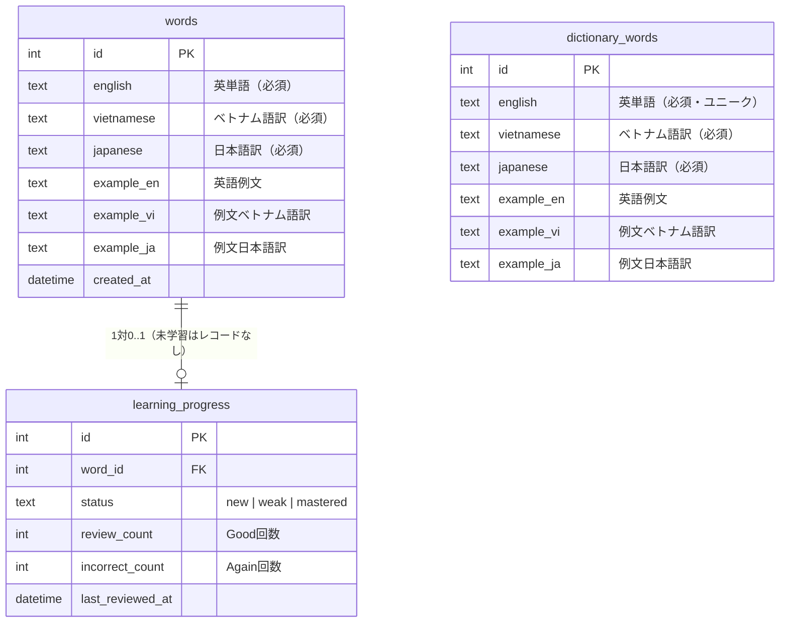

# アーキテクチャ設計

## 1. 技術スタック

| レイヤー | 技術 | 選定理由 |
|---------|------|---------|
| Frontend | React + TypeScript + Vite | コンポーネント単位の状態管理が単語帳UIに適合。TypeScriptで型安全を保証。ViteでiPhoneでも高速なHMR・ビルド |
| Backend | Hono（Bun runtime） | 軽量・高速・TypeScriptネイティブ。`zValidator`で型安全なAPI設計が可能。Bunでシングルバイナリに近い形で運用可能 |
| DB | SQLite（Bun built-in） | シングルユーザー・小規模データに最適。外部DBサーバー不要でデプロイが単純。BunのネイティブSQLiteで追加依存なし |
| スタイリング | CSS Modules | グローバル汚染なし。iPhoneセーフエリア対応を各コンポーネント単位で管理しやすい |
| 音声 | サーバーサイドTTS + HTML5 Audio | サーバー側でPiper/TTSエンジンを使用。HTMLAudioElementで再生。iOS自動再生制限の回避策が必要 |
| ホスティング | Bun serve（単一プロセス） | HonoでAPIとReact静的ファイルを同一サーバーで配信。引っ越しが容易 |

### なぜ Vanilla JS ではなく React を選んだか

仕様書では「Vanilla JSで軽量に」という案も示されているが、以下の理由でReactを採用する。
- 言語トグル・自動再生モード・カード状態など、UI状態が複数かつ相互に影響するため、Reactの宣言的UIが保守性を高める
- TypeScript型共有（shared/types.ts）によりAPIとUIの型ズレをビルド時に検出できる
- 将来の機能追加（ページネーション、フィルター等）への拡張コストが低い

---

## 2. ディレクトリ構成

```
learning-word/
├── src/
│   ├── client/                  # React フロントエンド
│   │   ├── components/
│   │   │   ├── FlashCard/
│   │   │   │   ├── FlashCard.tsx
│   │   │   │   └── FlashCard.module.css
│   │   │   ├── WordList/
│   │   │   │   ├── WordList.tsx
│   │   │   │   ├── WordListItem.tsx
│   │   │   │   └── WordList.module.css
│   │   │   ├── LanguageToggle/
│   │   │   │   └── LanguageToggle.tsx
│   │   │   └── AudioButton/
│   │   │       └── AudioButton.tsx
│   │   ├── hooks/
│   │   │   ├── useSession.ts    # セッション管理
│   │   │   ├── useSpeech.ts     # Web Speech API
│   │   │   └── useAutoPlay.ts   # 自動再生ロジック
│   │   ├── pages/
│   │   │   ├── StudyPage.tsx    # フラッシュカード + 単語リスト
│   │   │   └── AdminPage.tsx    # 管理画面
│   │   ├── App.tsx
│   │   └── main.tsx
│   ├── server/                  # Hono バックエンド
│   │   ├── routes/
│   │   │   ├── session.ts       # GET /api/session
│   │   │   ├── review.ts        # POST /api/review
│   │   │   ├── words.ts         # GET /api/words
│   │   │   └── admin.ts         # CRUD（Basic認証付き）
│   │   ├── db.ts                # SQLite接続・クエリ
│   │   └── index.ts             # Honoアプリ本体
│   └── shared/
│       └── types.ts             # フロント・バック共有型定義
├── db/
│   ├── schema.sql               # テーブル定義
│   ├── seed.json                # 初期単語データ
│   └── migrations/              # 将来のマイグレーション用
├── spec/
│   └── design/                  # 本設計書群
├── index.html
├── vite.config.ts
├── tsconfig.json
└── package.json
```

---

## 3. データモデル（ERD）



### マイグレーション戦略

- V1はスキーマ変更を`schema.sql`の再実行で対応（データ量が少ないため許容）
- `db/migrations/` ディレクトリに番号付きSQLファイルを追加することで将来的な追跡可能に
- マイグレーションライブラリ（drizzle等）の導入はV2で検討

### 出題ロジック（SQL）

```sql
-- 優先枠（4問）: 弱点 or 未学習
SELECT w.* FROM words w
LEFT JOIN learning_progress p ON w.id = p.word_id
WHERE p.word_id IS NULL          -- 完全新規
   OR p.status = 'weak'
   OR p.incorrect_count > 0
ORDER BY COALESCE(p.incorrect_count, 999) DESC, RANDOM()
LIMIT 4;

-- 通常枠（6問）: mastered含む残り（優先枠の単語を除外）
SELECT w.* FROM words w
LEFT JOIN learning_progress p ON w.id = p.word_id
WHERE w.id NOT IN (/* 優先枠のID */  )
ORDER BY RANDOM()
LIMIT 6;
```

---

## 4. API エンドポイント一覧

| Method | Path | 認証 | 説明 | リクエスト | レスポンス |
|--------|------|------|------|-----------|-----------|
| GET | `/api/session` | なし | セッション用単語10件取得 | - | `Word[]` |
| POST | `/api/review` | なし | 自己評価を記録 | `{ wordId, result: 'good'\|'again' }` | `{ ok: true }` |
| GET | `/api/words` | なし | 単語リスト取得（ページネーション） | `?page=1&limit=10` | `{ words: Word[], total: number }` |
| GET | `/api/words/:id` | なし | 単語1件取得 | - | `Word` |
| POST | `/api/admin/words` | Basic | 単語追加 | `WordInput` | `Word` |
| PUT | `/api/admin/words/:id` | Basic | 単語更新 | `Partial<WordInput>` | `Word` |
| DELETE | `/api/admin/words/:id` | Basic | 単語削除 | - | `{ ok: true }` |
| GET | `/api/admin/dictionary/search` | Basic | 辞書から英単語を前方一致検索 | `?q=...` | `string[]` |
| GET | `/api/admin/dictionary/lookup` | Basic | 特定の英単語の対訳と例文を取得 | `?english=...` | `DictionaryWord | null` |

### 共有型定義（shared/types.ts）

```typescript
export type DictionaryWord = {
  id: number;
  english: string;
  vietnamese: string;
  japanese: string;
  example_en: string | null;
  example_vi: string | null;
  example_ja: string | null;
};

export type Word = {
  id: number;
  english: string;
  vietnamese: string;
  japanese: string;
  example_en: string | null;
  example_vi: string | null;
  example_ja: string | null;
  created_at: string;
};

export type LearningProgress = {
  word_id: number;
  status: 'new' | 'weak' | 'mastered';
  review_count: number;
  incorrect_count: number;
  last_reviewed_at: string | null;
};

export type WordWithProgress = Word & {
  progress: LearningProgress | null;
};

export type ReviewInput = {
  wordId: number;
  result: 'good' | 'again';
};

export type WordInput = Omit<Word, 'id' | 'created_at'>;
```

---

## 5. フロントエンド状態管理

Reactの `useState` / `useReducer` + カスタムフックで管理。外部状態管理ライブラリは不要。

```typescript
// セッション状態（useSession フック内）
type SessionState = {
  words: WordWithProgress[];
  currentIndex: number;
  isAnswerVisible: boolean;
  isComplete: boolean;
};

// アプリ全体の設定状態（App.tsx）
type AppState = {
  language: 'vi' | 'ja';
  isAutoPlay: boolean;
  autoPlayInterval: number; // 秒
};
```

---

## 6. iOS / Safari 対応事項

| 制約 | 対策 |
|------|------|
| HTML5 Audio はユーザーアクション起点必須（非同期再生不可） | 最初のユーザー操作（タップ等）の同期コールバック内で、共有 `HTMLAudioElement` の `play()` を実行してアンロックする。以降はこのアンロック済みインスタンスを使い回す。 |
| 自動再生やuseEffectからの非同期音声再生がブロックされる | 上記の共有 `HTMLAudioElement` をアンロック後に `src` を書き換えて再生することで、非同期コンテキストや自動再生でも再生を可能にする。 |
| サイレントスイッチで音が出ない | UIに「音が出ない場合はサイレントモードを確認」の説明表示 |
| セーフエリア | `env(safe-area-inset-bottom)` をCSSで適用（固定フッターボタン） |
| `100vh` 問題 | `100dvh` を使用（iOS 15.4+対応、フォールバックあり） |
