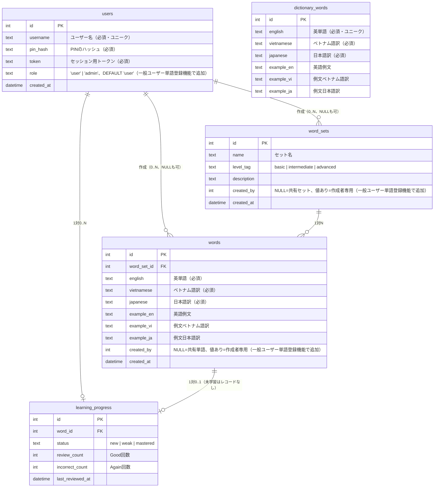

# アーキテクチャ設計

## 1. 技術スタック

| レイヤー | 技術 | 選定理由 |
|---------|------|---------|
| Frontend | React + TypeScript + Vite | コンポーネント単位の状態管理が単語帳UIに適合。TypeScriptで型安全を保証。ViteでiPhoneでも高速なHMR・ビルド |
| Backend | Hono（Bun runtime） | 軽量・高速・TypeScriptネイティブ。`zValidator`で型安全なAPI設計が可能。Bunでシングルバイナリに近い形で運用可能 |
| DB | SQLite（Bun built-in） | シングルユーザー・小規模データに最適。外部DBサーバー不要でデプロイが単純。BunのネイティブSQLiteで追加依存なし |
| スタイリング | CSS Modules | グローバル汚染なし。iPhoneセーフエリア対応を各コンポーネント単位で管理しやすい |
| 音声 | サーバーサイドTTS + HTML5 Audio | サーバー側でPiper/TTSエンジンを使用。HTMLAudioElementで再生。iOS自動再生制限の回避策が必要 |
| ホスティング | Bun serve（単一プロセス） | HonoでAPIとReact静的ファイルを同一サーバーで配信。引っ越しが容易 |

### なぜ Vanilla JS ではなく React を選んだか

仕様書では「Vanilla JSで軽量に」という案も示されているが、以下の理由でReactを採用する。
- 言語トグル・自動再生モード・カード状態など、UI状態が複数かつ相互に影響するため、Reactの宣言的UIが保守性を高める
- TypeScript型共有（shared/types.ts）によりAPIとUIの型ズレをビルド時に検出できる
- 将来の機能追加（ページネーション、フィルター等）への拡張コストが低い

### なぜ PostgreSQL / MySQL / ドキュメントDB へ移行しないか（2026-07時点で再評価）

一般ユーザーによる単語登録機能（[user-word-management.md](./user-word-management.md)）の追加を機にDB選定を再評価したが、SQLite継続を選択した。

**本番サーバーの実測値**（2026-07時点）:

| 項目 | 値 |
|------|-----|
| 物理メモリ | 2.0GB（`MemTotal` 1.9Gi） |
| メモリ使用中 / available | 544MB used / 1.4GB available |
| Swap | 2.0GB（ほぼ未使用） |
| ディスク | 48GB中 42GB空き（使用率14%） |
| CPU | 3コア |
| アプリ（learning-word）使用メモリ | 113MB（ピーク333MB） |
| SQLite DBファイルサイズ | 212KB（単語数千語でこの規模） |

**判断根拠**:
- ディスクは42GB空きがあり、PostgreSQLのベース消費（クラスタ初期化＋WALで200〜500MB程度）は全く問題にならない。
- ボトルネックはメモリ。PostgreSQLは最小構成でも常駐に数百MB〜1GB程度を専有し、現状の available 1.4GBに対して固定コストとして重く乗る。Node.jsアプリ本体（113〜333MB）やnginx等の他プロセスと合わせると、2GB機ではメモリに明確に余裕がなくなる。
- 現状のデータ規模（DBファイル212KB、数千語、同時接続数人）は、SQLiteの技術的な限界（大規模同時書き込み、複数アプリからの共有アクセス、複雑な分析クエリ）には遠く及ばない。今回追加する`created_by`による所有権管理・CASCADE削除も、SQLiteのFK制約・WALモードで十分に実現できる。
- ドキュメントDB（MongoDB等）は、今回の設計がFK・CASCADE削除・UNIQUE制約に強く依存するリレーショナルなデータモデルであるため不採用。JOINや整合性保証をアプリケーション側で再実装するコストの方が大きい。

**再評価のトリガー**（今後この判断を見直すべき条件）:
- サーバースペックを4GB以上のプランに増強するタイミング
- 複数サーバーインスタンスでの水平スケール（SQLiteはファイルベースのため単一ノード前提）が必要になったタイミング
- 同時書き込みが頻発する規模（数百人規模の同時アクセス等）に成長したタイミング

---

## 2. ディレクトリ構成

```
learning-word/
├── src/
│   ├── client/                  # React フロントエンド
│   │   ├── components/
│   │   │   ├── FlashCard/
│   │   │   │   ├── FlashCard.tsx
│   │   │   │   └── FlashCard.module.css
│   │   │   ├── WordList/
│   │   │   │   ├── WordList.tsx
│   │   │   │   ├── WordListItem.tsx
│   │   │   │   └── WordList.module.css
│   │   │   ├── LanguageToggle/
│   │   │   │   └── LanguageToggle.tsx
│   │   │   └── AudioButton/
│   │   │       └── AudioButton.tsx
│   │   ├── hooks/
│   │   │   ├── useSession.ts    # セッション管理
│   │   │   ├── useSpeech.ts     # Web Speech API
│   │   │   └── useAutoPlay.ts   # 自動再生ロジック
│   │   ├── pages/
│   │   │   ├── StudyPage.tsx    # フラッシュカード + 単語リスト
│   │   │   └── AdminPage.tsx    # 管理画面
│   │   ├── App.tsx
│   │   └── main.tsx
│   ├── server/                  # Hono バックエンド
│   │   ├── routes/
│   │   │   ├── session.ts       # GET /api/session
│   │   │   ├── review.ts        # POST /api/review
│   │   │   ├── words.ts         # GET /api/words
│   │   │   └── admin.ts         # CRUD（Basic認証付き）
│   │   ├── db.ts                # SQLite接続・クエリ
│   │   └── index.ts             # Honoアプリ本体
│   └── shared/
│       └── types.ts             # フロント・バック共有型定義
├── db/
│   ├── schema.sql               # テーブル定義
│   ├── seed.json                # 初期単語データ
│   └── migrations/              # 将来のマイグレーション用
├── spec/
│   └── design/                  # 本設計書群
├── index.html
├── vite.config.ts
├── tsconfig.json
└── package.json
```

---

## 3. データモデル（ERD）



### マイグレーション戦略

- V1はスキーマ変更を`schema.sql`の再実行で対応（データ量が少ないため許容）
- `db/migrations/` ディレクトリに番号付きSQLファイルを追加することで将来的な追跡可能に
- マイグレーションライブラリ（drizzle等）の導入はV2で検討
- 実運用では `src/server/db.ts` の `migrateColumns()` が起動時に不足カラムを検知して `ALTER TABLE ADD COLUMN` する自前方式を採用している。**カラム追加は必ず追記のみとし、既存データの `DELETE` や再登録強制は行わない**（過去に `pin_hash`/`token` 追加時に全ユーザーを削除した前例があるが、今後はこのパターンを踏襲しない）。詳細は [一般ユーザーによる単語・単語セット登録](./user-word-management.md) を参照。

### 出題ロジック（SQL）

```sql
-- 優先枠（4問）: 弱点 or 未学習
SELECT w.* FROM words w
LEFT JOIN learning_progress p ON w.id = p.word_id
WHERE p.word_id IS NULL          -- 完全新規
   OR p.status = 'weak'
   OR p.incorrect_count > 0
ORDER BY COALESCE(p.incorrect_count, 999) DESC, RANDOM()
LIMIT 4;

-- 通常枠（6問）: mastered含む残り（優先枠の単語を除外）
SELECT w.* FROM words w
LEFT JOIN learning_progress p ON w.id = p.word_id
WHERE w.id NOT IN (/* 優先枠のID */  )
ORDER BY RANDOM()
LIMIT 6;
```

---

## 4. API エンドポイント一覧

| Method | Path | 認証 | 説明 | リクエスト | レレスポンス |
|--------|------|------|------|-----------|-----------|
| GET | `/api/session` | トークン | セッション用単語10件取得（共有＋自分専用のみ） | - (X-User-Token ヘッダー) | `Word[]` |
| POST | `/api/review` | トークン | 自己評価を記録 | `{ wordId, result: 'good'\|'again' }` (X-User-Token ヘッダー) | `{ ok: true }` |
| GET | `/api/words` | トークン | 単語リスト取得（ページネーション、共有＋自分専用のみ） | `?page=1&limit=10` (X-User-Token ヘッダー) | `{ words: Word[], total: number }` |
| POST | `/api/words` | トークン | 自分専用の単語を作成 | `WordInput` (X-User-Token ヘッダー) | `Word`（`created_by`=自分） |
| PUT | `/api/words/:id` | トークン | 自分の単語を更新（他人の単語は404） | `Partial<WordInput>` (X-User-Token ヘッダー) | `Word` |
| DELETE | `/api/words/:id` | トークン | 自分の単語を削除（他人の単語は404） | - (X-User-Token ヘッダー) | `{ ok: true }` |
| GET | `/api/word-sets` | トークン | 単語セット一覧取得（共有＋自分専用のみ） | - (X-User-Token ヘッダー) | `WordSet[]` |
| POST | `/api/word-sets` | トークン | 自分専用の単語セットを作成 | `WordSetInput` (X-User-Token ヘッダー) | `WordSet`（`created_by`=自分） |
| PUT | `/api/word-sets/:id` | トークン | 自分のセットを更新（他人のセットは404） | `Partial<WordSetInput>` (X-User-Token ヘッダー) | `WordSet` |
| DELETE | `/api/word-sets/:id` | トークン | 自分のセットを削除（配下の自分の単語もCASCADE削除） | - (X-User-Token ヘッダー) | `{ ok: true }` |
| POST | `/api/users` | なし | ユーザー登録（PIN設定） | `{ username, pin }` | `{ id, username, token }` |
| POST | `/api/users/login` | なし | ユーザーログイン | `{ username, pin }` | `{ id, username, token }` |
| DELETE | `/api/users/:id` | トークン | ユーザー削除（トークン必須・本人限定・本人確認必須） | `{ pin }` (X-User-Token ヘッダー) | `{ success: true }` |
| GET | `/api/admin/words` | Basic | 全単語取得（所有者に関わらず全件） | - | `Word[]` |
| POST | `/api/admin/words` | Basic | 単語追加（共有単語として、`created_by`はNULL） | `WordInput` | `Word` |
| PUT | `/api/admin/words/:id` | Basic | 単語更新（所有者に関わらず全件対象） | `Partial<WordInput>` | `Word` |
| DELETE | `/api/admin/words/:id` | Basic | 単語削除（所有者に関わらず全件対象） | - | `{ ok: true }` |
| GET | `/api/admin/dictionary/search` | Basic | 辞書から英単語を前方一致検索 | `?q=...` | `string[]` |
| GET | `/api/admin/dictionary/lookup` | Basic | 特定の英単語の対訳と例文を取得 | `?english=...` | `DictionaryWord | null` |

> 一般ユーザー向けの単語・単語セットCRUDと、管理者向けの `/api/admin/*`（Basic認証）は完全に別ルートとして併存する。詳細は [一般ユーザーによる単語・単語セット登録](./user-word-management.md) を参照。

### ユーザー認証ミドルウェア (X-User-Token)

セッション・自己評価・単語リスト・ユーザー削除の各APIは、共通の認証ミドルウェアを介して保護される。
クライアントは `X-User-Token` ヘッダーにセッション用トークンを付与してリクエストを行う。
サーバー側はトークンを検証し、紐づく `userId` を内部的に導出して処理を行う。リクエストパラメータとしての `userId` の受け取りは廃止され、他人のデータへの不正アクセスを完全に遮断する。

### PINセキュリティ強化

- PINハッシュ化には **PBKDF2-SHA512 (210,000イテレーション)** を使用する。
- ログイン検証時のハッシュ比較には定数時間比較 (`crypto.timingSafeEqual`) を使用し、タイミング攻撃を防ぐ。
- 同一IP（接続元IPを直接取得し偽装を防止）および同一ユーザー名（グローバル制限）に対するログイン失敗カウントに基づくレートリミット（ロックアウト）を導入し、総当たり攻撃および setInterval による定期クリーンアップによるメモリリークを防止する。
- 登録重複時のエラーは汎用的な「このユーザー名は利用できません」とし、ユーザー名の存在有無を推測しにくくする（列挙攻撃対策）。
- マイグレーション移行時に既存ユーザーは安全のためすべてクリア（削除）され、新規に再登録を促す。

### 共有型定義（shared/types.ts）

```typescript
export type DictionaryWord = {
  id: number;
  english: string;
  vietnamese: string;
  japanese: string;
  example_en: string | null;
  example_vi: string | null;
  example_ja: string | null;
};

export type Word = {
  id: number;
  english: string;
  vietnamese: string;
  japanese: string;
  example_en: string | null;
  example_vi: string | null;
  example_ja: string | null;
  created_at: string;
};

export type LearningProgress = {
  word_id: number;
  status: 'new' | 'weak' | 'mastered';
  review_count: number;
  incorrect_count: number;
  last_reviewed_at: string | null;
};

export type WordWithProgress = Word & {
  progress: LearningProgress | null;
};

export type ReviewInput = {
  wordId: number;
  result: 'good' | 'again';
};

export type WordInput = Omit<Word, 'id' | 'created_at'>;
```

---

## 5. フロントエンド状態管理

Reactの `useState` / `useReducer` + カスタムフックで管理。外部状態管理ライブラリは不要。

```typescript
// セッション状態（useSession フック内）
type SessionState = {
  words: WordWithProgress[];
  currentIndex: number;
  isAnswerVisible: boolean;
  isComplete: boolean;
};

// アプリ全体の設定状態（App.tsx）
type AppState = {
  language: 'vi' | 'ja';
  isAutoPlay: boolean;
  autoPlayInterval: number; // 秒
};
```

---

## 6. iOS / Safari 対応事項

| 制約 | 対策 |
|------|------|
| HTML5 Audio はユーザーアクション起点必須（非同期再生不可） | 最初のユーザー操作（タップ等）の同期コールバック内で、共有 `HTMLAudioElement` の `play()` を実行してアンロックする。以降はこのアンロック済みインスタンスを使い回す。 |
| 自動再生やuseEffectからの非同期音声再生がブロックされる | 上記の共有 `HTMLAudioElement` をアンロック後に `src` を書き換えて再生することで、非同期コンテキストや自動再生でも再生を可能にする。 |
| サイレントスイッチで音が出ない | UIに「音が出ない場合はサイレントモードを確認」の説明表示 |
| セーフエリア | `env(safe-area-inset-bottom)` をCSSで適用（固定フッターボタン） |
| `100vh` 問題 | `100dvh` を使用（iOS 15.4+対応、フォールバックあり） |
