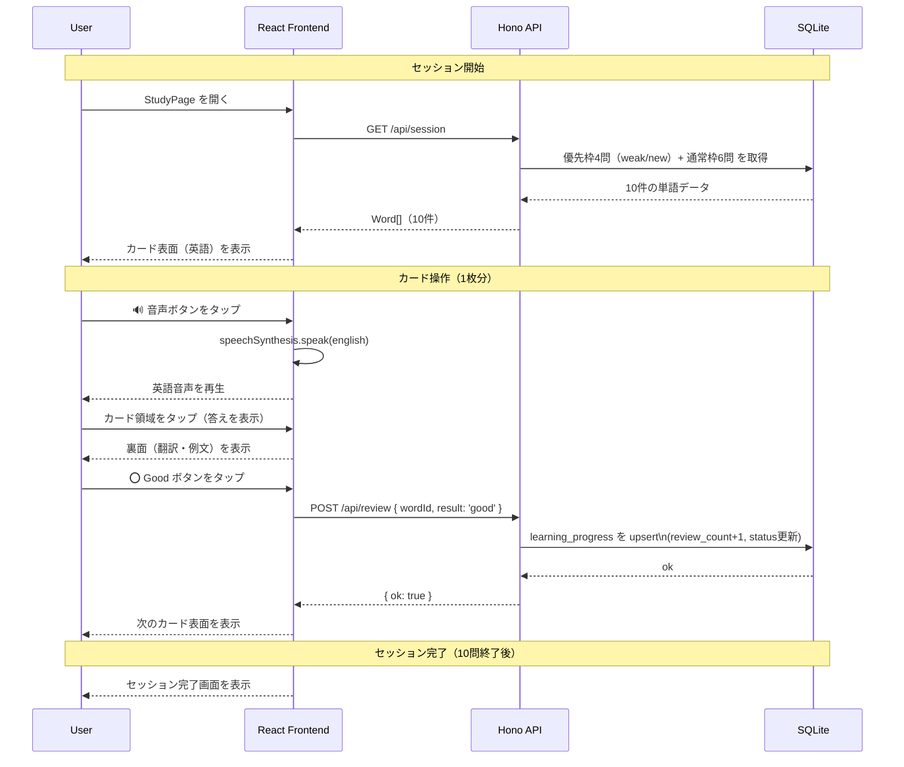
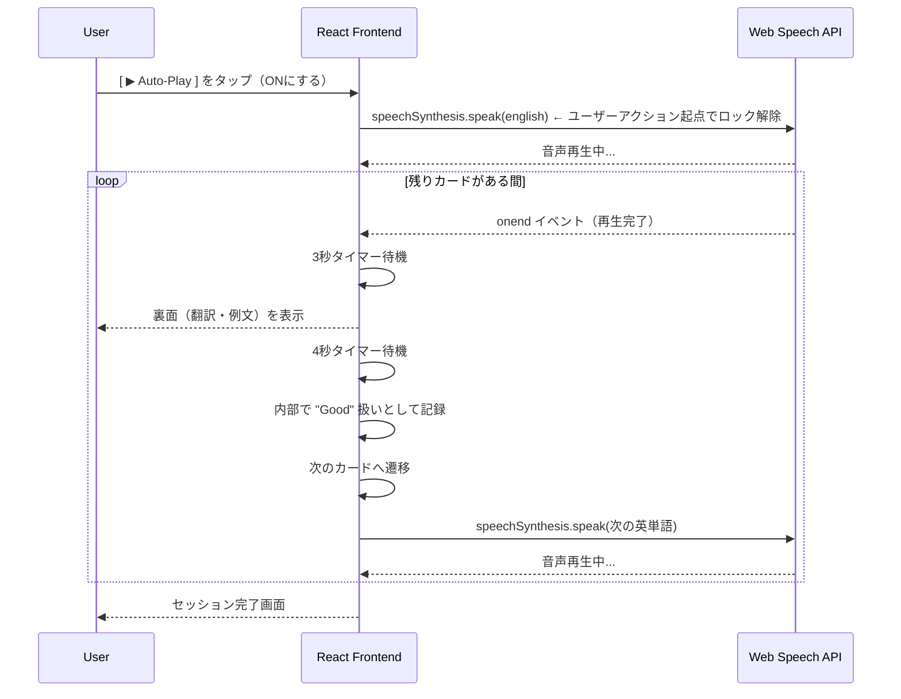
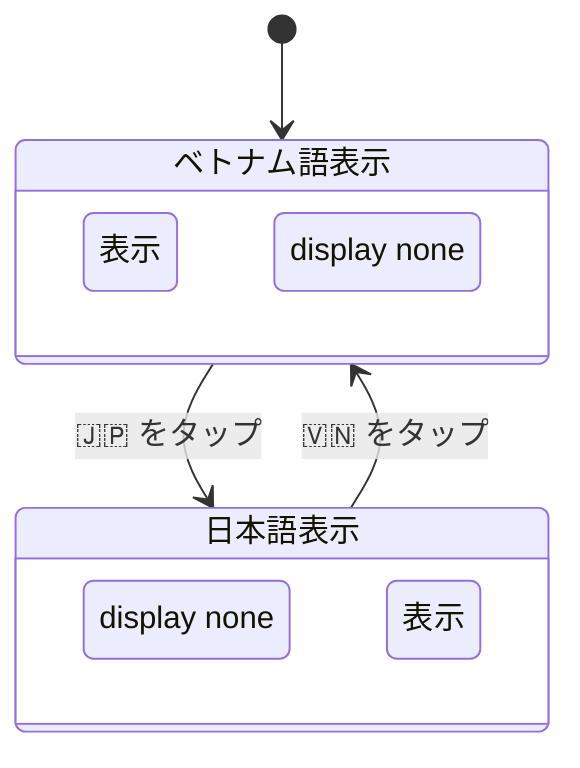

# フラッシュカード機能 詳細設計

## 概要

Ankiベースのフラッシュカード学習。1セッション10問。  
ユーザーは英語表面を見て記憶を確認し、タップで裏面（翻訳・例文）を表示。  
`Good / Again` で自己評価し、次回出題の重み付けを調整する。

---

## 画面レイアウト（ワイヤーフレーム）

```
+------------------------------------------+
| [≡]                       [🇻🇳 / 🇯🇵 Toggle] |  ← 言語トグル
+------------------------------------------+
|           Progress: 3 / 10               |  ← セッション進捗
|                                          |
|  +--------------------------------------+|
|  |                                      ||
|  |            apple                     ||  ← 英単語（フォント大）
|  |                                      ||
|  |              🔊                      ||  ← 音声再生ボタン
|  |                                      ||
|  +--------------------------------------+|
|                                          |
|  [ ▶ Auto-Play: OFF ]  [ ⚙ 3s / 4s ]   |  ← 自動再生トグル
|                                          |
+------------------------------------------+
|           [ 👁 答えを表示 ]               |  ← 下部全体がタップ可能
+------------------------------------------+

           ▼ 答えを表示後

+------------------------------------------+
|  +--------------------------------------+|
|  |            apple              🔊     ||
|  | ─────────────────────────────────── ||
|  |  [🇻🇳] quả táo                        ||  ← 選択言語の翻訳
|  |  [🇯🇵] りんご         ← 非選択は非表示  ||
|  |                                      ||
|  |  Ex: I ate an apple.                 ||  ← 英語例文
|  |      Tôi đã ăn một quả táo.          ||  ← ベトナム語訳（🇻🇳時）
|  |                                      ||
|  +--------------------------------------+|
+------------------------------------------+
|   [ ❌ Again ]          [ ⭕ Good ]       |  ← 自己評価ボタン
+------------------------------------------+
```

---

## シーケンス図 — 通常フロー（手動操作）



---

## シーケンス図 — 自動再生モード（Auto-Play）



---

## 言語トグルの動作



CSSで `data-lang` 属性を使い制御する（JSで翻訳の切り替えを行わない）。

```css
/* body[data-lang="vi"] のとき */
body[data-lang="vi"] .ja-content { display: none; }
body[data-lang="ja"] .vi-content { display: none; }
```

---

## ステータス遷移ロジック

| 操作 | 処理 | ステータス変化 |
|------|------|----------------|
| Good | review_count +1 | (new / weak) → mastered |
| Again | incorrect_count +1 | (new / mastered) → weak |

> masteredの単語は通常枠（6問）の抽選対象になり、優先枠（4問）からは外れる。


---

## エラーハンドリング

| エラー | フロントエンドの動作 |
|--------|---------------------|
| GET /api/session が失敗 | 「単語の読み込みに失敗しました。再試行してください」をカード位置に表示 |
| POST /api/review が失敗 | トースト通知「記録できませんでした」を表示し、次のカードには進む |
| Web Speech API 非対応 | 🔊 ボタンをグレーアウト、「このブラウザは音声非対応です」を表示 |
| 単語が0件 | 「単語がありません。管理画面から追加してください」を表示 |

---

## 受け入れ基準（Acceptance Criteria）

```
機能名: フラッシュカード表示

AC1: セッション開始時、GET /api/session からWord[]（最大10件）が取得され、
     1枚目のカード表面（英語）が表示されること。

AC2: カード領域（裏面ボタン含む）をタップすると、
     選択中の言語（🇻🇳 or 🇯🇵）の翻訳・例文が表示されること。
     非選択の言語は DOM上に存在するが display:none で不可視であること。

AC3: 🔊 ボタンをタップすると、英単語が英語音声で再生されること。
     再生中にタップすると、現在の再生をキャンセルして再度再生されること。

AC4: 「⭕ Good」ボタンをタップすると、POST /api/review に { wordId, result:'good' } が送信され、
     次のカード（index+1）の表面が表示されること。

AC5: 「❌ Again」ボタンをタップすると、POST /api/review に { wordId, result:'again' } が送信され、
     次のカードが表示されること。

AC6: 「Good」が積み重なりステータスが mastered になった単語は、
     次セッションで優先枠（4問）に入らないこと。

AC7: 10問すべて回答すると、「セッション完了！」画面が表示されること。
     「もう一度」ボタンで新しいセッションが開始されること。
     「レベル選択へもどる」ボタンをタップすると、レベル選択画面（/levels）へ遷移すること。


機能名: 自動再生モード

AC8: Auto-Play トグルをONにすると、英語音声再生→3秒待機→裏面表示→4秒待機→次カードが
     自動で繰り返されること。

AC9: Auto-Play 中にトグルをOFFにすると、即座に自動進行が停止し、
     現在のカードで通常操作（手動タップ）に戻ること。

AC10: Auto-Play の待機秒数（3s / 4s）を⚙設定から変更できること。
      変更は即座に次のカードから反映されること。

AC11: 「こたえを見る」ボタンがカードの下部で大きすぎずコンパクトなサイズ（fullWidthではなく適正な幅、またはパディングが抑えられたサイズ）で配置されていること。
      また、学習画面上部のヘッダー領域（マスコット、コンボ数、ミュートボタン、ユーザーNavアバター）は、横幅が狭い場合でも視覚的ごちゃつきを防ぐためにサイズが縮小され、コンパクトに整理されたレイアウトであること。

AC12: カード裏面の表示領域（高さ380px〜400px程度）および例文表示枠（最大高さ140px以上）を十分に確保し、選択中の翻訳と言語別の例文（原文と対訳）がスクロールせずに一目で確認できること。全体の余白やフォントサイズは、美しく整ったデザインを維持するよう調整されていること。

AC13: カード裏面が表示された際（手動タップによる表示、および自動再生モード時の両方）、自動的に単語と英語例文（結合テキスト：`${word.english}. ${word.example_en}`）がゆっくりめの速度（通常の0.8倍速）で発音されること。この自動再生は、再レンダリングやキャッシュ更新等による重複トリガーを適切に制御し、1回のみ再生されること。また、自動再生モード時は、この裏面での発音（単語＋例文）が完了した後に、裏面待機秒数（backDelay）のカウントダウンが開始されること。
```
