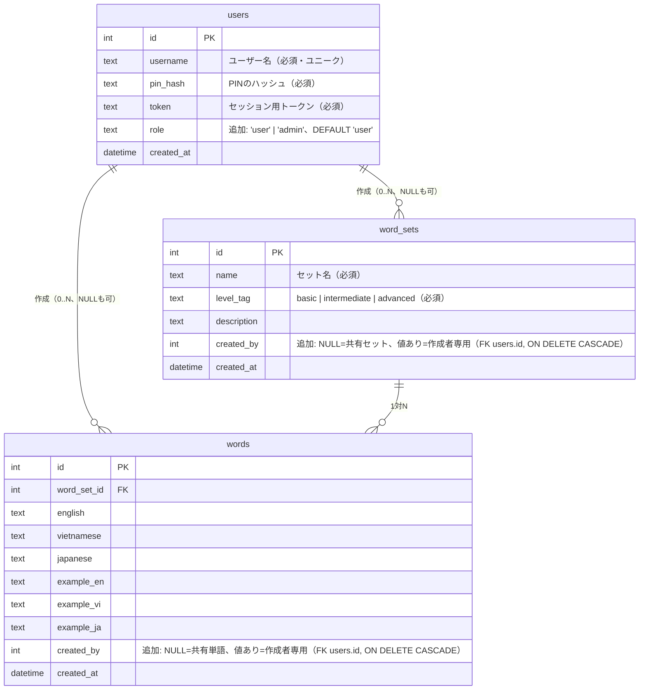
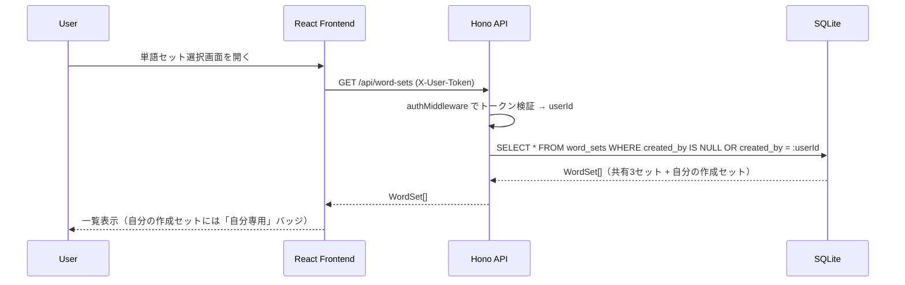
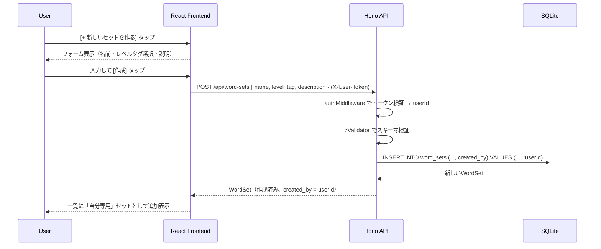
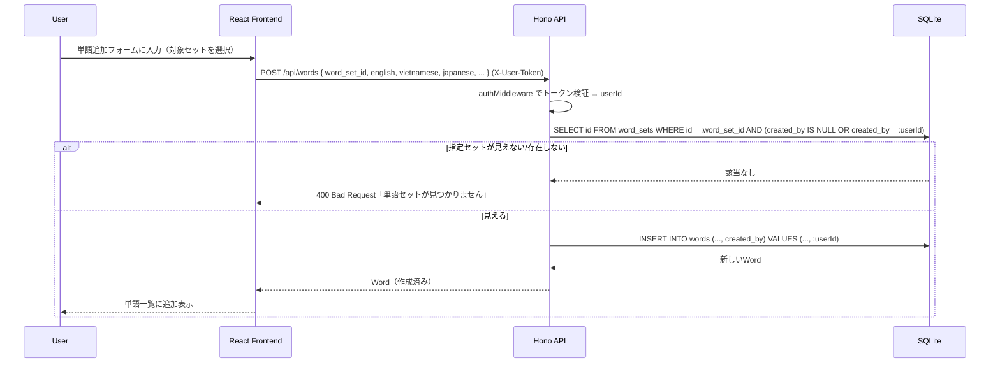
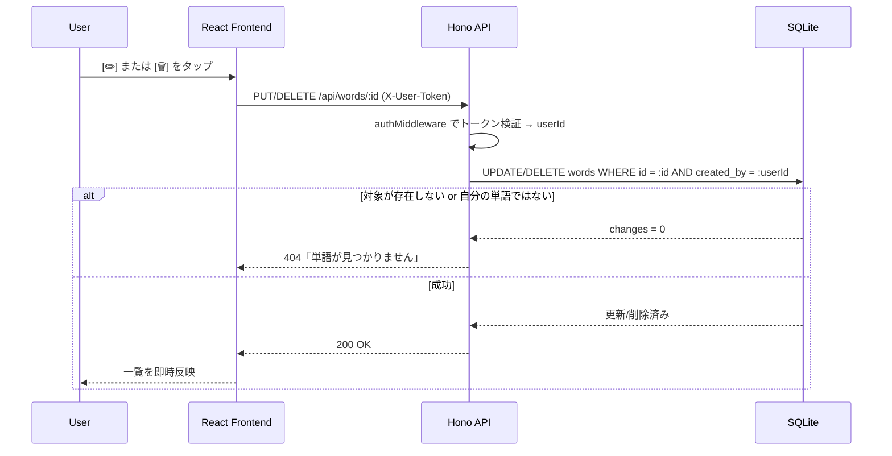

# 一般ユーザーによる単語・単語セット登録 詳細設計

## 概要

現状、単語（`words`）の登録・編集・削除は管理者（Basic認証）のみが行える。
本設計では、一般ユーザー（トークン認証済みのアプリユーザー）にも「自分専用の単語」および「自分専用の単語セット」を作成・編集・削除できる機能を追加する。

管理者が登録した既存の単語・単語セットは引き続き全ユーザーに共有され、一般ユーザーが作成したものは **本人にのみ表示** される。既存ユーザー・既存データを一切壊さないことを最優先とする。

---

## ユーザーストーリー

* **As a** アプリを日常的に使う学習者、
* **I want to** 自分が覚えたい単語や自分だけの単語帳（セット）を自由に追加・編集・削除したい、
* **So that** 管理者に頼らず、自分の興味やレベルに合わせて語彙を拡張し、パーソナライズされた学習ができる。

* **As a** 既存の管理者（パートナー）、
* **I want to** 自分が管理する共有単語データが、一般ユーザーの操作によって勝手に書き換えられたり削除されたりしないようにしたい、
* **So that** 全ユーザー共有の基礎単語セットの品質を維持できる。

---

## スコープ（MoSCoW）

| 優先度 | 内容 |
|--------|------|
| **Must have** | ・一般ユーザーがログイン後、自分専用の単語を作成・編集・削除できる<br>・一般ユーザーがログイン後、自分専用の単語セット（レベルタグは既存の basic/intermediate/advanced から必須選択）を作成・編集・削除できる<br>・自分が作成した単語・単語セットは自分にのみ表示され、他ユーザーには一切表示されない<br>・既存の管理者登録データ（`created_by IS NULL`）は引き続き全ユーザーに共有される<br>・自分が作成していない単語・単語セットは編集・削除できない（404で拒否） |
| **Should have** | ・単語追加フォームに、管理者向けと同様の辞書オートコンプリート（前方一致サジェスト＋自動翻訳プレフィル）を一般ユーザーにも提供する<br>・自分のアカウント削除時に、自分が作成した単語・単語セットも連動して削除される |
| **Could have** | ・自分のセット一覧に「作成した単語数」を表示する<br>・単語登録数の上限（例: 1ユーザーあたり500件）を設けて濫用を防止する |
| **Won't have** | ・他ユーザーが作成した単語・単語セットの閲覧や共有申請機能（承認制での全体公開）<br>・単語・単語セットの「いいね」「共有リンク」などSNS的機能<br>・admin権限をDBのrole列だけで完全にHTTP Basic認証から置き換えること（別マイルストーンで検討） |

---

## データモデル変更

### 変更方針（重要な前提）

このプロジェクトはマイグレーションツールを持たず、`src/server/db.ts` の `migrateColumns()` が起動時に `ALTER TABLE` を実行する自前方式である。
過去に `pin_hash` / `token` カラム追加時、移行対象ユーザーを **`DELETE FROM users` で全消去** した前例があるが、今回はこれを踏襲しない。
**`ALTER TABLE ... ADD COLUMN ...` の追記のみ**とし、既存の `users` / `words` / `word_sets` の行を一切削除・改変しない。

### ERD差分



### マイグレーションSQL（追記のみ）

```sql
-- users: 将来の権限拡張用（現行のBasic認証adminはそのまま維持し、既存挙動は変えない）
ALTER TABLE users ADD COLUMN role TEXT NOT NULL DEFAULT 'user';

-- word_sets: 所有者列を追加。既存の3セットはNULLのまま＝全員共有を維持
ALTER TABLE word_sets ADD COLUMN created_by INTEGER REFERENCES users(id) ON DELETE CASCADE;

-- words: 所有者列を追加。既存の全単語はNULLのまま＝全員共有を維持
ALTER TABLE words ADD COLUMN created_by INTEGER REFERENCES users(id) ON DELETE CASCADE;
```

### `ON DELETE CASCADE` を選んだ理由

`created_by` の参照アクションは `SET NULL` ではなく **`CASCADE`** を採用する。
`SET NULL` にすると、ユーザーがアカウントを削除した瞬間に、そのユーザーの「自分専用」だった単語・単語セットの `created_by` が `NULL` になり、**本来非公開だったデータが全ユーザーに公開されてしまう**（意図しない情報漏洩）。
`CASCADE` であれば、アカウント削除と同時に本人専用データも一緒に消え、「自分専用」という前提が崩れない。

### `migrateColumns()` への追加方針（実装フェーズ向けメモ）

- 既存の `if (!columns.includes('pin_hash'))` 等と同じパターンで、`users.role` / `word_sets.created_by` / `words.created_by` の存在チェック → 無ければ `ALTER TABLE ADD COLUMN` を実行する分岐を追加する。
- **`DELETE FROM ...` は一切呼ばない。** 追記のみで既存データ・既存トークンを保持する。
- `words`/`word_sets` は現状 `migrateColumns()` の対象外（`users` テーブルのみ処理している）ため、同関数内に `words` / `word_sets` 用のカラムチェック分岐を新設する。

---

## API一覧（新規・変更）

| Method | Path | 認証 | 説明 | 変更点 |
|--------|------|------|------|--------|
| GET | `/api/word-sets` | トークン | 単語セット一覧取得 | **変更**: `WHERE created_by IS NULL OR created_by = :userId` で自分専用セットも含めて返す |
| POST | `/api/word-sets` | トークン | 自分専用の単語セットを作成 | **新規**: `created_by = userId` で作成 |
| PUT | `/api/word-sets/:id` | トークン | 自分の単語セットを編集 | **新規**: `created_by = userId` の行のみ更新可（他人の行は404） |
| DELETE | `/api/word-sets/:id` | トークン | 自分の単語セットを削除 | **新規**: `created_by = userId` の行のみ削除可。配下の`words`はCASCADEで削除 |
| GET | `/api/words` | トークン | 単語一覧取得 | **変更**: `WHERE word_set_id = ? AND (created_by IS NULL OR created_by = :userId)` |
| GET | `/api/session` | トークン | フラッシュカード用単語取得 | **変更**: 優先枠・通常枠のSQL双方に `(created_by IS NULL OR created_by = :userId)` を追加（後述のリスク参照） |
| POST | `/api/words` | トークン | 自分専用の単語を作成 | **新規**: `created_by = userId` で作成。`word_set_id` は自分から見えるセット（共有 or 自分の）のみ指定可 |
| PUT | `/api/words/:id` | トークン | 自分の単語を編集 | **新規**: `created_by = userId` の行のみ更新可（他人の行は404） |
| DELETE | `/api/words/:id` | トークン | 自分の単語を削除 | **新規**: `created_by = userId` の行のみ削除可 |
| GET/POST/PUT/DELETE | `/api/admin/words` 系 | Basic | 管理者による全単語CRUD | **変更なし**。管理者は所有者に関わらず全単語を操作可能なまま |

> 一般ユーザー向けの新規エンドポイントは、既存の `/api/words`・`/api/word-sets` ルート（`authMiddleware` 適用済み）に `POST`/`PUT`/`DELETE` ハンドラを追加する形で実装する。管理者用の `/api/admin/*`（Basic認証）とは完全に別ルートのまま維持し、認証方式を混在させない。

### なぜ `created_by` を条件にした「404」で統一するか

自分以外が所有する単語・単語セットへの `PUT`/`DELETE` は、「403 Forbidden（存在するが権限がない）」ではなく **「404 Not Found」** を返す。
他人のデータの存在有無を判別できてしまうと（403は「存在するが権限がない」を意味してしまうため）、IDの総当たりで他ユーザーの登録データの存在を推測できてしまう。既存の「ユーザー削除」機能で採用されている情報漏洩対策の考え方（`docs/spec/design/risks.md` R10）と統一する。

### レイヤー構成（既存アーキテクチャに準拠）

既存の `routes → usecases → repositories → domain` の層構造を踏襲する。

```
src/server/
├── domain/
│   ├── userWord.ts       # 新規: IUserWordRepository（create/update/delete、所有権チェック込み）
│   └── userWordSet.ts    # 新規: IUserWordSetRepository
├── repositories/
│   ├── wordRepository.ts       # 既存: getWords/getSession に可視性フィルタを追加
│   ├── userWordRepository.ts   # 新規: create(userId, input) / update(userId, id, input) / delete(userId, id)
│   ├── wordSetRepository.ts    # 既存: getWordSetsForUser に可視性フィルタを追加
│   └── userWordSetRepository.ts # 新規: 同様のCRUD
├── usecases/
│   ├── userWord.ts       # 新規: CreateUserWordUseCase / UpdateUserWordUseCase / DeleteUserWordUseCase
│   └── userWordSet.ts    # 新規: 同様のUseCase群
└── routes/
    ├── words.ts          # 既存: POST/PUT/DELETE ハンドラを追加
    └── wordSets.ts        # 既存: POST/PUT/DELETE ハンドラを追加
```

`update`/`delete` はリポジトリのSQL自体に `WHERE id = ? AND created_by = ?` を含める（アプリ側で先にSELECTして所有権チェックしてからDELETEする2段階にしない）。これにより所有権チェックと更新/削除がアトミックになり、チェックと実行の間に競合が起きるTOCTOU（Time-of-check to time-of-use）を避けられる。

---

## シーケンス図

### 単語セット一覧取得（可視性フィルタ）



### 自分専用の単語セットを新規作成



### 自分専用の単語を作成



### 自分の単語を編集・削除（所有権チェック）



---

## バリデーション仕様

既存の `WordInputSchema` / `WordPartialInputSchema`（`src/server/schemas/wordInput.ts`）をそのまま再利用する（一般ユーザー用に別スキーマを設ける必要はない）。

新規に `WordSetInputSchema` を追加する。

```typescript
import { z } from 'zod';

export const WordSetInputSchema = z.object({
  name:        z.string().min(1, 'セット名は必須です').max(100),
  level_tag:   z.enum(['basic', 'intermediate', 'advanced'], {
    errorMap: () => ({ message: 'レベルは basic / intermediate / advanced から選択してください' }),
  }),
  description: z.string().max(300).optional().nullable(),
});

export const WordSetPartialInputSchema = WordSetInputSchema.partial();
```

---

## エラーハンドリング

| エラー | ステータス | フロントエンドの動作 |
|--------|-----------|---------------------|
| トークン未指定・無効 | 401 | 既存の自動ログアウト導線（401時にログイン画面へ誘導）に合流 |
| バリデーションエラー | 400 | 各フィールド下にエラーメッセージを赤字表示 |
| 存在しない/見えない `word_set_id` を指定して単語作成 | 400 | 「単語セットが見つかりません」を表示 |
| 他人の単語・単語セットへのPUT/DELETE | 404 | 「単語（セット）が見つかりません」を表示（他人のデータの存在は示唆しない） |
| POST/PUT/DELETE 失敗（DBエラー等） | 500 | 「操作に失敗しました。再試行してください」をトースト表示 |

---

## 受け入れ基準（Acceptance Criteria）

```
機能名: 一般ユーザーによる単語登録・編集・削除

AC1: ログイン済みユーザーが単語追加フォームから english/vietnamese/japanese/word_set_id を入力して保存すると、
     POST /api/words が実行され、created_by = 自分のuserId として単語が作成されること。

AC2: 自分が作成した単語のみ、単語一覧上に編集(✏️)・削除(🗑)ボタンが表示されること。
     管理者が登録した単語（created_by = NULL）や他ユーザーが作成した単語には、これらのボタンが表示されないこと。

AC3: 自分が作成した単語に対して PUT /api/words/:id を実行すると、内容が更新され一覧に反映されること。

AC4: 自分が作成した単語に対して DELETE /api/words/:id を実行すると、確認ダイアログの後に削除され、一覧から消えること。

AC5: 他ユーザーが作成した単語のIDを直接指定して PUT/DELETE /api/words/:id を呼び出しても、404が返り、
     対象データは一切変更・削除されないこと（他人のデータへの不正操作を防止）。

AC6: 自分が作成した単語は自分の単語一覧・学習セッション（フラッシュカード）にのみ出題され、
     他ユーザーの単語一覧・学習セッションには一切表示されないこと。

AC7: 既存の管理者登録単語（created_by = NULL）は、マイグレーション適用後も件数・内容が一切変化せず、
     全ユーザーに引き続き共有表示されること。

機能名: 一般ユーザーによる単語セット登録・編集・削除

AC8: ログイン済みユーザーがセット作成フォームから name・level_tag（basic/intermediate/advancedのいずれか）を入力して保存すると、
     POST /api/word-sets が実行され、created_by = 自分のuserId としてセットが作成されること。

AC9: 自分が作成したセットのみ、セット一覧上に「自分専用」バッジと編集・削除ボタンが表示されること。

AC10: 自分が作成したセットを削除すると、そのセットに属する自分の単語もすべて削除されること（CASCADE）。

AC11: 既存の3つの共有セット（basic/intermediate/advanced、created_by = NULL）は、マイグレーション適用後も
      一切変化せず、全ユーザーに引き続き共有表示されること。
```

---

## 成功指標（KPI）

* **自己登録機能の利用率**: マイグレーション適用後30日以内に、アクティブユーザーのうち **20%以上** が自分専用の単語を最低1件登録すること。
* **データ整合性**: マイグレーション適用の前後で、既存の管理者登録単語・単語セットの件数が **完全一致（差分0件）** すること（回帰テストで検証）。

---

## 依存関係・既存ドキュメントとの整合性

* `docs/spec/design/admin.md`（管理者CRUD）: 変更なし。Basic認証・エンドポイントとも維持。
* `docs/spec/design/word-list.md`（単語リスト表示）: `GET /api/words` のレスポンスに可視性フィルタが入るため、フロントエンドの型（`WordWithProgress`）に変更はないが、返却される単語の集合が「共有＋自分専用」に変わる。編集・削除ボタンの表示条件（`created_by === 自分のuserId`）をコンポーネント側に追加する必要がある。
* `docs/spec/design/architecture.md`: ERD・APIエンドポイント一覧・マイグレーション戦略セクションを本設計に合わせて更新する（別途追記）。
* `docs/spec/design/risks.md`: 本機能固有のリスクを追記する（別途追記）。

---

## UI/UX・デザイン視点の考慮（Berryテーマ準拠）

一般ユーザーが操作する「単語・単語セットのCRUD」および関連する画面表示は、アプリのデザインシステムである「Berryテーマ（ピンク/やさしい/報われる）」のガイドラインに完全準拠して実装する。

### 1. ビジュアルデザインとスタイリング仕様

*   **入力フォーム（単語・単語セット作成/編集）**:
    *   **角丸と余白**: 入力フィールドは `--radius-btn` (`18px`) の角丸、コンテナカードは `--radius-card` (`28px`)、余白は 8px 単位（`--space-unit`）で統一する。
    *   **配色とフォーカス状態**: 背景は `--surface`、テキストは `--ink-700`、ラベルは `--ink-900`。ボーダーは `rgba(255,111,165,0.18)` とし、フォーカス時は `--berry-500` の太い枠線と `--shadow-soft` を適用する。
    *   **フォントサイズ**: iOS Safari の入力ズーム（ズームインによりレイアウトが崩れる現象）を防ぐため、入力欄のテキストは `16px`（最小）とする。
*   **ボタン**:
    *   **登録・送信ボタン (CTA)**: `--berry-500` 背景、フォントは `--ink-900` または白、角丸 `--radius-btn`、上部に微細なハイライト、下部に `--shadow-soft` を適用した「ぷっくり感」を演出。押下時には `translateY(1px)` の沈み込みと `--shadow-press` へ変化させる。
    *   **編集(✏️)・削除(🗑)ボタン**: 単語リストの各カードに控えめに配置する。鋭利なアイコンを避け、丸っこいSVGまたは絵文字を使用し、色は `--ink-400` または `--berry-500` の淡いトーンに抑えてリスト全体の調和を保つ。
*   **バッジ**:
    *   **「自分専用」バッジ**: ユーザー作成の単語セット一覧カードに表示する。`--berry-100` 背景に `--berry-600`（または `--ink-900`）テキストのピル型バッジ（`--radius-pill`）とし、やさしいプライベート感を表現する。
    *   **ステータス表示**: リスト上の学習ステータスは `New` を `--lavender-500`、`Weak` を `--coral-500`、`Mastered` を `--mint-500` の小さなドット (`StatusDot`) で表示し、強い警告色によるストレスを排除する。

### 2. マイクロコピーと感情設計（やさしい言葉遣い）

*   **削除時の確認ダイアログ (感情に配慮したモーダル)**:
    *   機械的な「本当に削除しますか？」ではなく、マスコット（Berry 🍓）がやさしく問いかける応援形の表現にする。
    *   例：「この単語と、おわかれする？」(Again/Delete) という確認テキストに対し、キャンセルは「やっぱりいっしょにいる！」(Good)、実行は「バイバイする」(Again) のような、ユーザーの学習努力を否定しないやさしい表現を選択肢とする。
*   **登録成功・編集成功時のトースト**:
    *   操作完了時に、`--mint-100` 背景に `--mint-500` テキストとマスコット絵文字（🍓）を添えたトーストを表示する。
    *   例：「あたらしい単語を覚えたよ！いっしょにがんばろう🍓」
*   **登録上限（Phase 10）到達時のエラー表示**:
    *   「上限に達しました」という拒絶的なエラーではなく、ユーザーを労る前向きな表現にする。
    *   例：「いまはここまで！よくがんばったね。新しく追加するまえに、いまの単語をたくさん復習してあげよう🌸」

### 3. コンポーネント構造（Atomic Design）

新規および移行するUIコンポーネントは、以下の Atomic レイヤーに分類して実装し、規約を厳守する。

*   **Atoms**:
    *   `Badge.tsx`（汎用ピル型バッジ）
    *   `StatusDot.tsx`（学習ステータスのやさしいドット）
    *   `TextInput.tsx`（角丸・iOSズーム対策済み入力フィールド）
*   **Molecules**:
    *   `ConfirmModal.tsx`（やさしい削除確認用モーダル）
    *   `WordSetCard.tsx`（自分専用バッジ、編集・削除ボタン付き単語セットカード）
*   **Organisms**:
    *   `WordForm.tsx` / `WordSetForm.tsx`（オートコンプリートやバリデーションを内包した入力フォーム）

