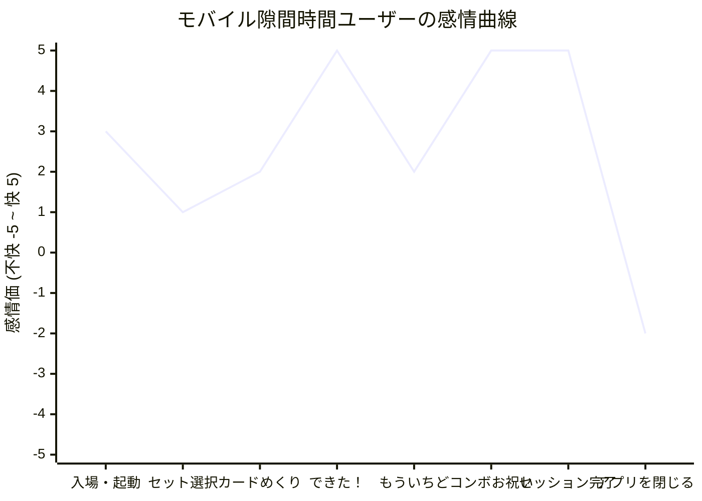
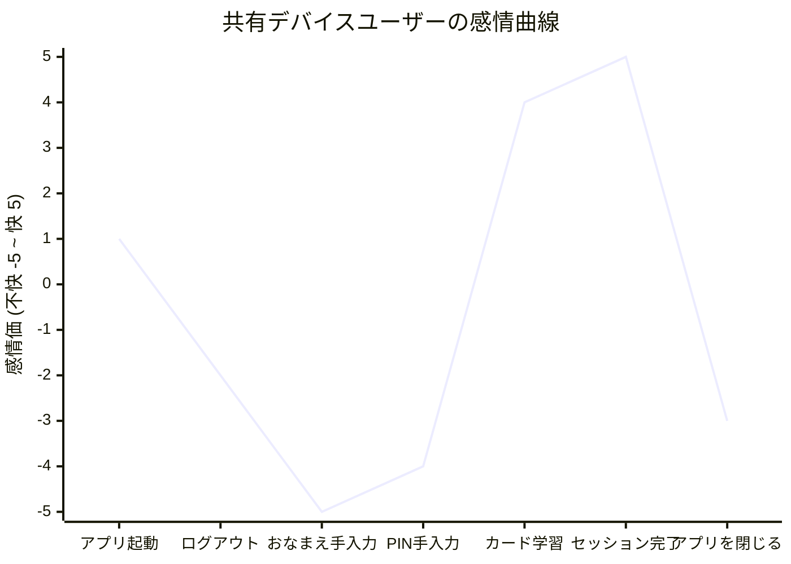

<UI/UX分析 - STEP 3: 感情曲線・モチベーション診断>

### 感情曲線（Mermaidグラフ）

#### 1. モバイル隙間時間ユーザー（スマホ・片手操作・3〜5分）

#### 2. 共有デバイスユーザー（PC/iPad共有・ファミリー/教育・複数ユーザー）

---

### 診断評価

#### 1. モバイル隙間時間ユーザーのジャーニー診断
*   **【山】正解（できた！）〜コンボ達成と完了演出**: 
    `StudyPage.tsx` において、正解時の軽快なピコーン音（`correct`）、デバイスの瞬間バイブレーション、画面のキラキラエフェクトが即座に同期して発動し、心地よい脳内報酬になっています。また、5コンボ等の節目で発動する `CelebrationOverlay` や、完了時のファンファーレは、隙間時間の単調な作業に最高のピーク体験（感情価 +5）をもたらしています。
*   **【谷（離脱点）①】スワイプ未対応による片手のテンポ阻害**:
    カードをめくる、正誤判定をする（「できた！」「もういちど」）の操作がタップにしか対応していません。片手操作時、親指を画面下部に正確に運んでボタンを凝視・タップする必要があり、歩きながらや電車内での流れるようなリズム学習が阻害されます（感情価 +2程度に留まる）。
*   **【谷（離脱点）②】セッション終了時の「おもてなし無き退場」**:
    完了画面で「できた！」と喜んだ直後、次の具体的な学習アクションの推奨や「今日のノルマ達成」の表示がなく、単に「セット一覧に戻る」だけになります。ここで「明日もやろう」という動機付け（トリガー）がないため、アプリを閉じた瞬間に熱量が急冷します（感情価 -2の急降下）。

#### 2. 共有デバイスユーザーのジャーニー診断
*   **【山】複数人で見守れる明快なビジュアル**:
    マスコットの「ベリーちゃん」やぷっくりしたUIは、子供や家族学習者にとって視覚的に非常に魅力的で、親しみやすさは抜群です。
*   **【最大の谷（致命的な離脱点）】ログイン時の「キーボード手入力」の壁**:
    共有デバイスでは、前回のユーザーがログインした状態（`activeUser` が localStorage に残っている）で起動されることがほとんどです。別の人が使おうとすると、
    1. 「ログアウト（べつの人でログインする）」を押す
    2. 新ログイン画面で、自分の「おなまえ」をキーボードでわざわざ文字入力する
    3. さらに「合言葉 (PIN)」を入力する
    という極めて面倒な手続きが必要です。特にタブレットを共有する子供たちや教育現場において、毎回「おなまえ」を手入力させるのは致命的な離脱ポイントになります（感情価 -5の最下点）。

#### 3. モチベーション設計（Octalysisフレームワーク）評価
*   **第2コアドライブ：開発と達成 (Development & Accomplishment) - 【評価: 高】**:
    連続コンボ数やお祝い演出など、短期のインゲーム・フィードバックは非常に優秀です。
*   **第4コアドライブ：所有欲と所有 (Ownership & Possession) - 【評価: 低】**:
    自分だけの単語帳を作れる楽しさはありますが、学習実績に応じたアバターアイテムの解放やバッジ・シールのコレクション要素がなく、長期的な所有欲を刺激できていません。
*   **第5コアドライブ：社会的影響力とつながり (Social Influence & Relatedness) - 【評価: 皆無】**:
    ファミリーやクラスメイトが同じデバイスで学習しているにもかかわらず、互いの進捗を褒め合ったり、ストリークをランキングで競ったりするようなソーシャル要素が一切ありません。
*   **第8コアドライブ：損失と回避 (Loss & Avoidance) - 【評価: 中】**:
    ストリーク（連続学習日数）の炎マークはあるものの、アプリを閉じた後に通知や思い出させるトリガーがないため、損失回避（「毎日続けないと途切れてしまう」）の心理が働く前にアプリを忘却されてしまいます。

---

### CEO指摘 [#1] - 共有デバイスにおける「手入力ログイン」による熱量の急冷と離脱
*   **体験のフェーズ**: 入場（アプリ起動 〜 ユーザー切り替え）
*   **現状の体験**:
    ファミリー共有や教室でのiPad使用時、別アカウントで入るために「ログアウト」し、ログイン画面で毎回キーボードを使って「おなまえ（英数字）」と「合言葉 (PIN)」を完全に手入力しなければならない。
*   **なぜ経営上の問題か**:
    起動時の入力障壁は「アプリを開くこと自体の億劫さ」に直結し、リピート率（DAU）および顧客生涯価値（LTV）を著しく低下させます。また、子供が一人でログインできずに保護者や先生の手を毎回煩わせるため、「面倒なアプリ」として解約や低評価、口コミ阻害の直接的要因になります。
*   **エンゲージメント改善仮説**:
    **「クイック・プロファイル・セレクター」の導入**
    サーバーのセキュリティ基準（PIN認証）を保ちつつ、ローカルに保存されている（または最近ログインした）ユーザーのアバターと名前をログイン画面にタイル状に一覧表示します。ユーザーは自分のアイコンをタップし、PINを入れるだけ（子供向けにはPIN省略設定も可能に）で、キーボード入力なしで即座に学習を開始できるようにします。

### CEO指摘 [#2] - 片手操作時の「タップ強要」によるプレイ快適性の喪失
*   **体験のフェーズ**: プレイ中（カードめくり 〜 回答選択）
*   **現状の体験**:
    モバイル隙間時間で利用する際、カード反転のために画面中央をタップし、さらに「できた！」「もういちど」の判定ボタンを正確に狙って画面下部を親指でタップし続けなければならない。
*   **なぜ経営上の問題か**:
    隙間時間学習において、片手で画面をじっと注視しながらボタンを探す操作は身体的ストレスを生みます。これが「単調な作業感」を強め、セッションの途中で飽きて離脱する原因となり、日々の完了率や学習継続率の低下を招きます。
*   **エンゲージメント改善仮説**:
    **「直感的なスワイプ（フリック）ジェスチャー」の導入**
    TinderやAnkiのように、カードを「右にスワイプで できた！（成功）」、「左にスワイプで もういちど（再挑戦）」、「ダブルタップで カード反転」ができるジェスチャー操作を導入します。これにより、画面の下部を細かく見なくても、親指一本の感覚的スワイプだけでテンポ良く学習を回せる「ゾーン（没入状態）」を作り出します。

### CEO指摘 [#3] - 学習完了後の「おもてなし無き退場」による継続トリガーの喪失
*   **体験のフェーズ**: 完了 〜 退場
*   **現状の体験**:
    セッション完了画面で「できた！」と華やかに祝福された後、次の学習ステップへのパーソナライズされた提案（「今日の目標まであと5語！」「次のおすすめはこれ！」）がなく、単に一覧へ戻るだけであり、アプリを閉じる際も無機質に終了する。
*   **なぜ経営上の問題か**:
    ユーザー体験の満足度は、ピーク時と「最後（エンド）」の印象で決まります（ピーク・エンド効果）。最後の体験が「プツリと一覧に戻って終わり」では、翌日また開くための動機（トリガー）が植え付けられず、翌日起動率の低下につながります。
*   **エンゲージメント改善仮説**:
    **「フックモデルに基づく継続フックの設置」**
    1.  **本日の進捗（ノルマ）の可視化**: リザルト画面で「本日の目標（例: 20語）に対する達成率」をゲージで示し、完了時に「目標クリア！🌸」の追加お祝いを出す。
    2.  **ファミリー間バトンタッチ機能**: 共有デバイスユーザー向けに、完了画面から「つぎはだれの番？（ユーザー切り替え）」へのショートカットを置き、家族間でのバトン学習を誘発する。
    3.  **自律的トリガーの設定**: アプリを閉じる前に「明日も同じ時間にベリーちゃんと勉強する？⏰」と、明日のリマインド（iOS/Androidのプッシュ通知、またはブラウザ通知）をワンタップでセットさせ、再訪のフックを作ります。

</UI/UX分析 - STEP 3: 感情曲線・モチベーション診断>
