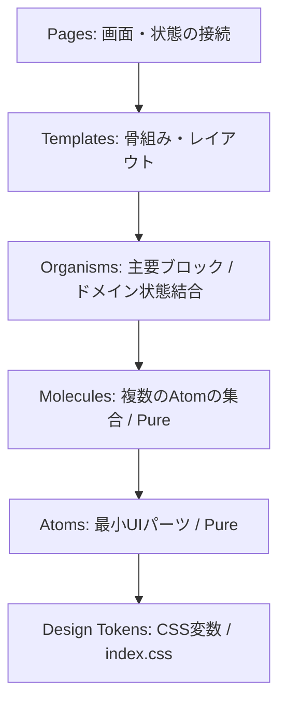

# コンポーネント構造仕様 (Atomic Design)

本ドキュメントは、再利用性・保守性を最大化し、UI変更による影響範囲を極小化するため、**Atomic Design** の原則に基づくコンポーネント分割、および依存関係の定義を行います。

---

## 1. 全体依存マップ (Dependency Map)

依存関係は常に上位から下位への「一方向（単方向）」とします。下位階層のコンポーネントが上位階層のコンポーネントを import することは禁止します。



---

## 2. 各階層の定義と役割

### 2.1. Atoms (最小UIパーツ)
*   **役割**: これ以上分解できない、状態（ビジネスロジック）を持たない純粋な見た目部品。
*   **実装ルール**: API接続やドメイン状態（ユーザー情報や単語データ）を持たず、すべての変更を `props` (および `onX` イベント) 経由で受け取る。
*   **主なコンポーネント**:
    *   `Button`: ぷっくりした角丸の汎用ボタン。
    *   `Text`: タイポグラフィシステムに沿ったテキストラッパー。
    *   `Badge`: レベル等を示す小さなバッジ。
    *   `Mascot`: ベリーちゃんの表情（`standard`, `happy`, `sad`）を絵文字やイラストでレンダリングする。
    *   `Sparkle`: 正解時に舞うキラキラエフェクト。
    *   `SoundToggle`: 音声オン/オフの状態を示すスイッチ。

### 2.2. Molecules (複合パーツ)
*   **役割**: 複数の Atoms を組み合わせ、特定の意味や簡単な機能を持たせた部品。依然として「Pure Components」（Props で制御され、ドメイン状態を持たない）である。
*   **主なコンポーネント**:
    *   `AudioButton`: 発音再生ボタン。内部で発音ロジック（TTS）は直接呼ばず、発音トリガーイベントのみを発火する。
    *   `ReviewButtons`: 「Good」と「Again」を並べた回答ボタンセット。
    *   `ProgressIndicator`: 学習の進捗（すすんだ割合）を表示するバー。
    *   `StreakBadge`: 継続日数を炎の絵文字とともに表示するバッジ。
    *   `SuccessToast`: 操作成功を伝える一時的なトースト表示。
    *   `WordSetCard`: レベル別のセットカード。進捗率を内部で計算するが、Props として進捗データを受け取る。

### 2.3. Organisms (画面ブロック)
*   **役割**: 複数の Molecules / Atoms を組み合わせた画面の主要領域。この階層から、**React Query などのドメイン状態や API 接続、Context** との結線が許容される。
*   **主なコンポーネント**:
    *   `FlashCard`: カードを「めくる」ジェスチャーやキーボード操作、めくる状態（表面/裏面）を管理する。
    *   `WordList`: ページネーション付きの単語一覧テーブル、追加・編集フォームモーダルを制御する。
    *   `SessionHeader`: セッション全体の進行状態や、ミュート切り替え等のナビゲーションヘッダー。
    *   `CelebrationOverlay`: 連続正解時に全画面にキラキラを降らせるお祝いエフェクト。
    *   `WordSetSelector`: タブの切り替えと単語セット一覧カードの表示を制御する。

### 2.4. Templates (レイアウト骨組み)
*   **役割**: 画面のグリッドやヘッダー・メインコンテンツ・フッターなどのレイアウト構造のみを定義する。プレースホルダー（`children`）の配置に特化する。
*   **主なコンポーネント**:
    *   `StudyTemplate` / `CompleteTemplate` / `WordSetSelectTemplate`

### 2.5. Pages (画面最終接続)
*   **役割**: ルーティングのエントリーポイント。すべての hooks を呼び出し、Organisms / Templates にデータを注入する。
*   **主なコンポーネント**:
    *   `StudyPage`: リストモードと学習モードの切り替え、セッション状態の同期。
    *   `WordSetSelectPage`: ユーザーが選択した後のレベル/セットのロードと選択ハンドラ。

---

## 3. ディレクトリおよびファイル構成ルール (CSS Modules)

1コンポーネント＝1ディレクトリの原則（**R-ATOM-04**）を徹底します。

```
src/client/components/
  ├ atoms/
  │  └ Button/
  │     ├ Button.tsx
  │     ├ Button.module.css
  │     └ index.ts (Entrypoint)
  ├ molecules/
  │  └ WordSetCard/
  │     ├ WordSetCard.tsx
  │     ├ WordSetCard.module.css
  │     └ index.ts
```

---

## 4. 既存コンポーネントの Atomic 移行対応表

既存の実装はすでにこのディレクトリ構造に概ね沿って配置されていますが、ビジネスロジックの依存を整理するための移設・リファクタリング方針です。

| コンポーネント名 | 現在の場所 | 新設計での分類・配置 | リファクタリング方針（クリーンアップ） |
|:---|:---|:---|:---|
| `Button` | `atoms/Button` | **Atoms** | 既存実装を維持。生HEXの排除を徹底。 |
| `AudioButton` | `molecules/AudioButton` | **Molecules** | 発音ロジック（TTS API）をコンポーネント内で直接呼び出さず、`onPlay` コールバックを親（Organism/Page）から受け取る形に整理。 |
| `FlashCard` | `organisms/FlashCard` | **Organisms** | カードが裏返る際の効果音の呼び出しは、`props.onFlip` を通じて親から呼び出すようフックと分離。 |
| `WordList` | `organisms/WordList` | **Organisms** | 単語のCRUD操作（API呼び出し、トースト表示）は、`useWords` フックをこの Organism で呼び出す設計を維持。 |
| `WordSetCard` | `molecules/WordSetCard` | **Molecules** | 編集・削除イベントを `onEdit`, `onDelete` として Props 抽出し、純粋な見た目部品（Pure）として維持。 |

---

## 5. 状態・APIアクセスの分離ルール

*   **状態の局所化**: 
    *   ボタンの `hover` や `active`、モーダルの `isOpen` などの「UIの見た目のための状態」は、Atom / Molecule の中で useState を使って管理してよい。
    *   単語のリストデータ、学習の進捗スコア、ローディング状態などの「アプリケーションのデータ状態」は、必ず Page または最上位の Organism で保持・取得し、下位の Molecules へ一方向の Props ダウンで渡す。
