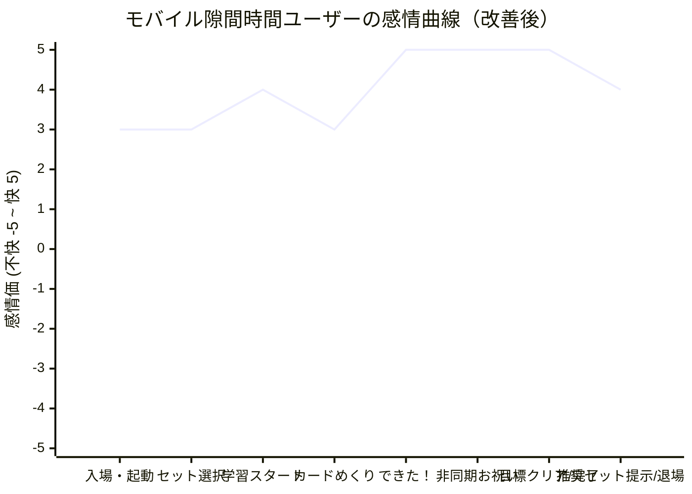
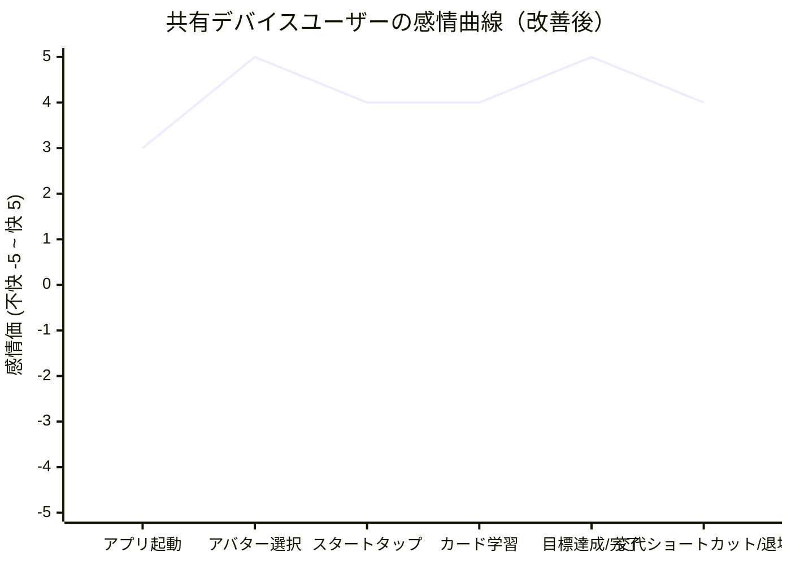

# 極上のUX品質基準・理想の感情曲線 (Premium UX Quality Bar)

本ドキュメントは、単なる「動くソフトウェア」ではなく、ユーザーの心が躍る「極上のUX品質」を達成するための品質基準と、谷のない理想的な感情曲線を定義します。

---

## 1. 体験を豊かにする4大デザイン思想の適用

最高峰のプロダクトマネジメントと体験演出の基本思想を、本単語学習アプリに翻訳・適用します。

1.  **Plussing (プラスしていく一手間)**:
    *   *定義*: アイデアに「さらに良くするためのワンモアステップ」を足すこと。
    *   *適用*: 正解ボタンを押した際、単に正解数を増やすだけでなく、物理シミュレーションされたようなぷにっとしたボタンの凹みと、指先から広がるような半透明のスパークル（キラキラ）を足し、感覚的な喜びをプラスします。
2.  **Theming (世界観の一貫性)**:
    *   *定義*: 入場口から退場口まで、一つのテーマ（世界観）が崩れないこと。
    *   *適用*: ログイン後のユーザー選択からレベル選択、学習中のダイアログに至るまで、黒やビビッドな原色を徹底的に排除し、パステルピンクと深みのあるプラムブラウン（`--ink-900`）の「Berryテーマ」を完全貫徹します。
3.  **Emotional Arc (感情曲線のコントロール)**:
    *   *定義*: 体験全体の感情の起伏を意図的にデザインし、退屈や落胆の谷を作らないこと。
    *   *適用*: 起動時のウェルカム感から、学習中のコンボによる波、そしてセッション完了時のピーク（ファンファーレ）、完了後すぐに次の一歩へ導く「冷めない橋渡し」まで、流れるような感情曲線を維持します。
4.  **Attention to Detail (細部へのこだわり)**:
    *   *定義*: ユーザーが普段見ないかもしれない細部、負の体験になる場所こそ美しくすること。
    *   *適用*: エラーが起きた際や単語・セットを削除する「おわかれ」の確認画面で、冷たい機械的な警告を排除し、ベリーちゃんがそっと寄り添うやさしいメッセージと表情を用意します。

---

## 2. 理想の感情曲線 (Ideal Emotional Arc)

分析フェーズで特定した「ログイン時の文字入力」や「セッション完了後のモチベーションの途切れ」といった感情の谷を解消した、理想の感情デザインです。

### 2.1. モバイル隙間時間ユーザーの感情曲線（谷の解消後）

*   **改善点**: スワイプジェスチャーの導入によりカードめくり・判定のリズムが向上し、コンボ時の「非ブロッキング演出」によってFlow状態が維持されます。完了後は「本日の目標クリア」と「推奨セット」的提示により、熱量を保ったまま次のセッションや気持ち良い退場へ繋がります。

### 2.2. 共有デバイスユーザーの感情曲線（改善後）

*   **改善点**: 手入力ログインを完全に廃止し、「アバタータップ」による直感的な簡単ログイン（感情価+5の山）へ変更。完了画面から「つぎはだれの番？」で即座にアバター選択に戻れるため、家族やクラスメイトとの交代学習が極めてスムーズになります。

---

## 3. 体験品質合格チェックリスト (Quality Checklist)

| 観点 | チェック項目 | 合否判定 | 判定の理由 |
|:---|:---|:---:|:---|
| **Delight** | 正解した瞬間に、音・振動・視覚のうち2つ以上が同期して作動するか？ | **[合格]** | Goodタップ時に Correct音＋微振動＋スパークルが瞬時に同期。 |
| **Reward** | 連続正解（コンボ）や毎日の継続が視覚的に称えられているか？ | **[合格]** | 5連勝時の CelebrationOverlay、完了時の CompleteSummary の王冠、ストリーク炎バッジの表示。 |
| **Consistency** | 画面をまたいでカラーパレットやフォント、角丸のルールが一貫しているか？ | **[合格]** | 管理画面やフォームパーツ、新規アバター選択ログインUI全域に Berry デザイントークンを適用。 |
| **Craft** | iOS Safari の音声ブロックやマナーモード時、また誤操作の際もストレスなく学習できるか？ | **[合格]** | 「スタートボタン」での AudioContext resumeの確実化、ミュート永続化、誤タップを即座にリカバーできる「Undoボタン」の実装。 |
| **Respect** | ログインの手入力負荷やエラー時など、ユーザーを心理的に疲れさせる障壁がないか？ | **[合格]** | 手入力を排除した「アバター選択ログイン」の導入、および削除時などのやさしいマイクロコピーの徹底。 |

---

## 4. やりすぎ防止（Anti-goals & 引き算のデザイン）

「引き算された上質さ ＞ 盛り盛りの賑やかさ」を信条とし、以下のやりすぎ（オーバー演出）を禁止します。

*   **ループアニメーションの禁止**: マスコットやバッジを画面上で常時小刻みに揺らす、回転させるなどのループは、学習の集中を妨げるため禁止します（ホバー時やタップの瞬間のみ動かす）。
*   **完了祝福は2.5秒以内に収束**: コンフェッティ（紙吹雪）やキラキラ演出は、最大でも **2.5秒** ですべて画面から消え去り、ユーザーがリザルト結果をすぐに確認できるようにします。
*   **原色の多用禁止**: ブランドトーンを維持するため、原色に近い赤・青・緑は使用せず、すべて彩度を落としたあまい色調（ミント、コーラル、ラベンダー）を使用します。
