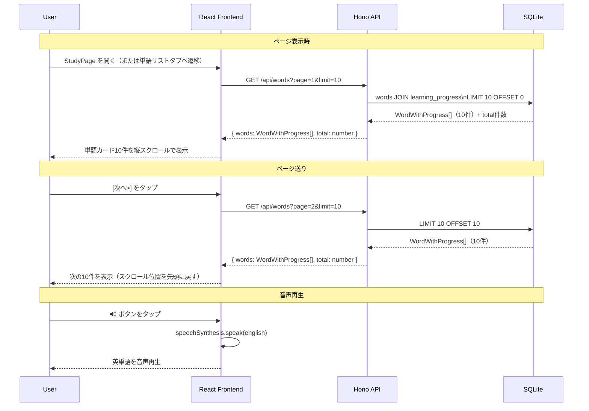
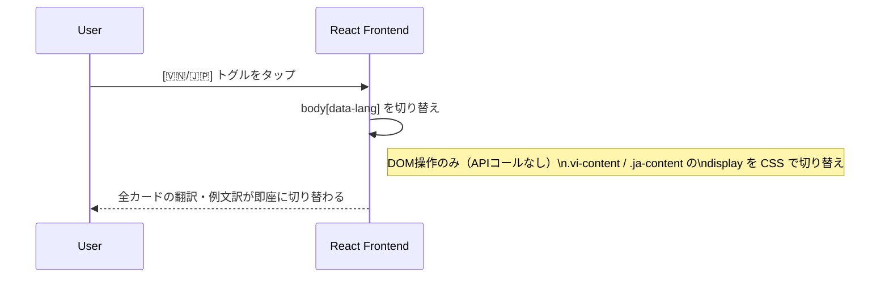

# 単語リスト機能 詳細設計

## 概要

希望.JPG（Maziiアプリ風）を忠実に再現した、縦スクロール式単語リストおよび学習ランチャー画面。
本画面は単語リストの閲覧と、そこから学習セッション（フラッシュカード）を起動するエントリーポイントとして機能する。

主要な構成要素：
1. **トップカード領域**: 現在選択中の単語の簡易的な表示。
2. **リストトグル**: `Danh sách từ` トグルスイッチ。ONの時のみ単語リストを表示する。
3. **単語リスト**: 1ページ10件のカード形式リスト。英単語、学習ステータスバッジ（new/review/mastered）、選択言語の翻訳・例文訳（言語トグルに対応）、メモ欄、日付、音声再生ボタン（🔊）を含む。
4. **ページネーション**: `[<] 1 / 15 [>]` ページ送り、および `10/Trang`（1ページあたりの件数切り替え）。
5. **練習開始ボタン**: 最下部に配置される青色の「Luyện tập (練習する)」固定ボタン。タップすると、10問のフラッシュカード学習セッションへ移行する。

---

## 画面レイアウト（ワイヤーフレーム）

```
+------------------------------------------+
| < Word Set Name          [🇻🇳/🇯🇵] [User] |  ← ヘッダーナビゲーション（言語トグル統合）
+------------------------------------------+
|                                          |
|                 apple                    |  ← トップ簡易表示
|                 🔊                       |
|                                          |
+------------------------------------------+
| 単語リスト / Danh sách  [ ○ Toggle ] [⇄] [▶] |  ← リストON/OFFトグル、コントロール
+------------------------------------------+
|  +--------------------------------------+|
|  |  apple           [New]             🔊 ||  ← 英単語 + ステータスバッジ + 音声
|  |  (vi) quả táo / (ja) りんご          ||  ← 選択言語の翻訳表示（自動切替）
|  |  An apple a day keeps the doctor away.||  ← 英語例文
|  |  (vi) Mỗi ngày một quả táo...        ||  ← 例文訳（自動切替）
|  |  (ja) 1日1個のりんごで医者いらず     ||
|  |  + Add note / メモを追加...          ||  ← メモ入力欄・追加ボタン
|  |                            30/06/2026||  ← 登録日/学習日
|  +--------------------------------------+|
|                                          |
|  +--------------------------------------+|
|  |  persistence     [Review]          🔊 ||
|  |  (vi) sự kiên trì / (ja) 粘り強さ     ||
|  |  Success requires persistence.       ||
|  |  (vi) Thành công đòi hỏi sự kiên trì.||
|  |  (ja) 成功には粘り強さが必要です。   ||
|  |  Ghi chú của bạn  [💾]       30/06/2026||  ← メモ保存・日付
|  +--------------------------------------+|
|                                          |
|  （以下、最大10件まで縦スクロール）        |
|                                          |
+------------------------------------------+
| [<]  1 / 15  [>]          [10/Trang  ▼]  |  ← ページネーション・件数切り替え
+------------------------------------------+
|          [ 🎓 Luyện tập / 練習開始 ]      |  ← 青色の練習開始ボタン（下部固定、言語連動）
+------------------------------------------+
```

---

## ステータスバッジの色定義

| ステータス | バッジ色 | 意味 |
|-----------|---------|------|
| `new` | 🟡 黄 | 未学習または初回 |
| `weak` | 🔴 赤 | Again を記録済み（要復習） |
| `mastered` | 🟢 緑 | Good 3回以上（習得済み） |

---

## シーケンス図 — 単語リスト表示



---

## シーケンス図 — 言語トグル（リスト内）



---

## APIレスポンス詳細

### GET /api/words

**クエリパラメータ**

| パラメータ | 型 | デフォルト | 説明 |
|-----------|---|-----------|------|
| page | number | 1 | ページ番号（1始まり） |
| limit | number | 10 | 1ページあたりの件数（最大50） |

**レスポンス**

```typescript
type WordsResponse = {
  words: WordWithProgress[];
  total: number;      // 全単語件数
  page: number;
  limit: number;
  totalPages: number; // Math.ceil(total / limit)
};
```

**SQL（JOIN + Pagination）**

```sql
SELECT
  w.*,
  COALESCE(p.status, 'new') as status,
  COALESCE(p.review_count, 0) as review_count,
  COALESCE(p.incorrect_count, 0) as incorrect_count,
  p.last_reviewed_at
FROM words w
LEFT JOIN learning_progress p ON w.id = p.word_id
ORDER BY w.id ASC
LIMIT :limit OFFSET :offset;
```

---

## エラーハンドリング

| エラー | フロントエンドの動作 |
|--------|---------------------|
| GET /api/words が失敗 | 「読み込みに失敗しました。再試行してください」を表示、リトライボタン表示 |
| total=0（単語が1件もない） | 「まだ単語が登録されていません」を表示 |
| ページが範囲外 | 最終ページに自動リダイレクト |

---

## 受け入れ基準（Acceptance Criteria）

```
機能名: 単語リスト表示

AC1: StudyPage を開いたとき、GET /api/words?page=1&limit=10 が実行され、
     最大10件の単語カードが縦スクロールで表示されること。

AC2: 各単語カードに以下の情報が表示されること。
     - 英単語（太字・大きめフォント）
     - 学習ステータスバッジ（new=黄 / weak=赤 / mastered=緑）
     - 選択言語の翻訳（🇻🇳:ベトナム語 / 🇯🇵:日本語）
     - 英語例文（存在する場合）
     - 例文の選択言語訳（存在する場合）
     - 🔊 音声ボタン

AC3: 🔊 ボタンをタップすると、その単語の英語音声が再生されること。

AC4: 言語トグル（🇻🇳/🇯🇵）を切り替えると、
     全カードの翻訳・例文訳が即座に切り替わること。
     APIの再取得は発生しないこと。

AC5: [次へ>] をタップすると次の10件が表示され、
     [< 前へ] で前の10件に戻れること。
     現在ページと総ページ数が「2 / 15 ページ」形式で表示されること。

AC6: 単語が1件もない場合、「まだ単語が登録されていません」というメッセージが表示されること。

AC7: フラッシュカードで Good/Again を記録した直後に単語リストを再読み込みすると、
     該当単語のステータスバッジが最新の状態に更新されること。
```
