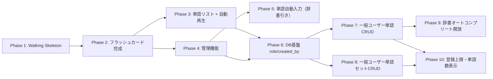

# 実装フェーズ計画

## 1. 概要

`spec/design/README.md` に基づくフェーズ分割。  
**Must → Should → Could** の順に積み上げ、Phase 1 は全レイヤーを貫く Walking Skeleton とする。  
高×高リスク（R1/R2: iOS Speech API）を Phase 1 で早期検証する。

---

## 2. 層マップ

機能 × レイヤー の実装項目表。

| 機能 | Domain | Infrastructure | Application | Presentation (Hono) | Frontend (React) |
|------|--------|----------------|-------------|---------------------|------------------|
| **[基盤]** プロジェクト初期化 | `shared/types.ts` (Word/LearningProgress/WordInput) | `db.ts` (SQLite接続・WAL設定) | — | `index.ts` (Honoアプリ本体) | `App.tsx`, `main.tsx`, Vite設定 |
| **[基盤]** DBスキーマ | — | `db/schema.sql`, `db/seed.json` | — | — | — |
| フラッシュカード（表） | `Word` 型 | `WordRepository.getSession()` (優先4+通常6) | `GetSessionUseCase` | `GET /api/session` | `StudyPage`, `FlashCard` (表面) |
| 音声再生 | — | — | — | — | `AudioButton`, `useSpeech` |
| Again / Good 自己評価 | `ReviewResult` VO, ステータス遷移ロジック | `ReviewRepository.upsert()` (learning_progress) | `SubmitReviewUseCase` | `POST /api/review` | Good/Again ボタン |
| 言語トグル | — | — | — | — | `LanguageToggle`, `body[data-lang]` CSS |
| セッション進捗表示 | — | — | — | — | `useSession` (progress state) |
| フラッシュカード（裏） | — | — | — | — | `FlashCard` (裏面・例文) |
| セッション完了画面 | — | — | — | — | 完了画面コンポーネント |
| 学習ステータス管理 | ステータス遷移ロジック | `learning_progress` UPSERT | `SubmitReviewUseCase` (status) | `POST /api/review` | ステータスバッジ表示 |
| 単語リスト表示 | `WordWithProgress` 型 | `WordRepository.getWords()` (JOIN + LIMIT/OFFSET) | `GetWordsUseCase` | `GET /api/words` | `WordList`, `WordListItem` |
| 自動再生モード | — | — | — | — | `useAutoPlay` |
| 管理画面（CRUD） | — | `AdminWordRepository` (INSERT/UPDATE/DELETE) | `AdminWordUseCase` | `POST/PUT/DELETE /api/admin/words` (Basic Auth) | `AdminPage` |
| ページネーション | — | LIMIT/OFFSET クエリ | `GetWordsUseCase` (page/limit) | `GET /api/words?page&limit` | ページネーション UI |
| DB基盤（role/created_by） | `Word`/`WordSet`型に`created_by`追加 | `schema.sql`・`migrateColumns()`追記、可視性フィルタSQL | — | — | — |
| 一般ユーザー単語CRUD | `IUserWordRepository` | `UserWordRepository`（所有権チェック込みSQL） | `CreateUserWordUseCase`ほか | `POST/PUT/DELETE /api/words`（トークン認証） | 単語追加フォーム、編集/削除ボタン（所有者のみ） |
| 一般ユーザー単語セットCRUD | `IUserWordSetRepository` | `UserWordSetRepository`（所有権チェック込みSQL） | `CreateUserWordSetUseCase`ほか | `POST/PUT/DELETE /api/word-sets`（トークン認証） | セット作成フォーム、「自分専用」バッジ |
| 辞書オートコンプリート開放 | — | `DictionaryRepository`（既存を再利用） | 既存UseCase再利用 | `GET /api/dictionary/search\|lookup`（トークン認証、新設） | 単語追加フォームへのサジェストUI追加 |
| 登録上限・単語数表示 | 上限値定数 | `countByUser()` | 作成UseCase内での上限チェック | 400エラー返却 | セット一覧の単語数バッジ |

---

## 3. フェーズ一覧

| Phase | 名称 | ゴール概要 | 優先度 | 依存 | 設計リンク |
|-------|------|-----------|--------|------|-----------|
| 1 | Walking Skeleton | 環境構築 + Session API + FlashCard表面 + 音声再生動作確認 | Must | なし | [flashcard.md](../../design/flashcard.md), [architecture.md](../../design/architecture.md) |
| 2 | フラッシュカード完成 | Good/Again評価 + 言語トグル + 進捗 + セッション完了 | Must | 1 | [flashcard.md](../../design/flashcard.md) |
| 3 | 単語リスト + 自動再生 | 単語リスト表示 + Auto-Playモード | Should | 2 | [word-list.md](../../design/word-list.md), [flashcard.md](../../design/flashcard.md) |
| 4 | 管理機能 | Basic認証付き単語CRUD + ページネーション | Could | 2 | [admin.md](../../design/admin.md), [word-list.md](../../design/word-list.md) |
| 5 | 単語自動入力（辞書引き） | 英単語入力時の対訳・例文サジェストと自動プレフィル | Could | 4 | [admin.md](../../design/admin.md) |
| 6 | DB基盤（role/created_by追加）＋可視性フィルタ | `users.role`・`words`/`word_sets`の`created_by`を追記マイグレーションで追加し、GET系APIが共有＋自分専用のみ返す | Must | 3, 4 | [user-word-management.md](../../design/user-word-management.md) |
| 7 | 一般ユーザー単語CRUD | 一般ユーザーが自分専用の単語を作成・編集・削除できる | Must | 6 | [user-word-management.md](../../design/user-word-management.md) |
| 8 | 一般ユーザー単語セットCRUD | 一般ユーザーが自分専用の単語セットを作成・編集・削除できる | Must | 6 | [user-word-management.md](../../design/user-word-management.md) |
| 9 | 辞書オートコンプリート開放 | 一般ユーザーの単語追加フォームにもサジェスト・自動プレフィルを提供 | Should | 7 | [user-word-management.md](../../design/user-word-management.md) |
| 10 | 登録上限・単語数表示 | 1ユーザーあたりの登録件数上限とセット単語数表示 | Could | 7, 8 | [user-word-management.md](../../design/user-word-management.md) |

---

## 4. フェーズ依存関係図

> Phase 3 と Phase 4 は Phase 2 完了後、並行して着手可能。
> Phase 7 と Phase 8 は Phase 6 完了後、並行して着手可能（対象テーブルが異なるため）。

---

## 5. 各フェーズ詳細リンク

- [Phase 1: Walking Skeleton](./phase-1.md)
- [Phase 2: フラッシュカード完成](./phase-2.md)
- [Phase 3: 単語リスト + 自動再生](./phase-3.md)
- [Phase 4: 管理機能](./phase-4.md)
- [Phase 5: 単語自動入力（辞書引き）](./phase-5.md)
- [Phase 6: DB基盤（role/created_by追加）＋可視性フィルタ](./phase-6.md)
- [Phase 7: 一般ユーザー単語CRUD](./phase-7.md)
- [Phase 8: 一般ユーザー単語セットCRUD](./phase-8.md)
- [Phase 9: 辞書オートコンプリート開放](./phase-9.md)
- [Phase 10: 登録上限・単語数表示](./phase-10.md)
