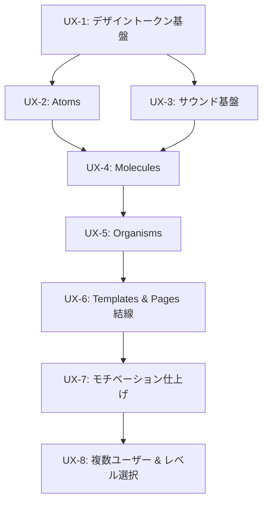

# UI/UX 実装計画 — "Berry" テーマ

> [../../design/ux/README.md](../../design/ux/README.md) の UI/UX 仕様を、`/impl` で実行できる粒度の実装計画に落とし込む。
> Atomic Design のボトムアップ（Tokens → Atoms → Molecules → Organisms → Templates → Pages）を実装順序とし、
> リスクの高いサウンド（iOS 解錠）を早期フェーズに置く。

---

## 1. 全体ゴール

現行の黒基調・英語混在・無反応な学習体験を、**Berry テーマ**（ピンク／やさしい／報われる）へ移行する。
- 機能ロジック（出題アルゴリズム・API・DB スキーマ）は**一切変更しない**（[../../design/ux/README.md](../../design/ux/README.md) §2 スコープ）。
- 変更対象は **UI/UX 層のみ**：デザイントークン・Atomic 再編・サウンド・モチベーション演出・マイクロコピー。
- 「作り直し」ではなく **既存コンポーネントの移行** を優先し、破壊範囲を最小化する。

---

## 2. フェーズ一覧（Atomic ボトムアップ）

| Phase | 名称 | ゴール概要 | 優先度 | 依存 | 計画書 |
|-------|------|-----------|--------|------|--------|
| UX-1 | デザイントークン基盤 | `:root` に Berry トークン定義。背景/テキスト/影を黒→ピンクへ置換（最小の見た目移行） | Must | なし | [phase-1.md](./phase-1.md) |
| UX-2 | Atoms | Button / Icon / Text / Chip / Badge / StatusDot / Mascot / Sparkle / SoundToggle | Must | UX-1 | [phase-2.md](./phase-2.md) |
| UX-3 | サウンド基盤 | `useSound`（AudioContext 解錠・Web Audio 合成・ミュート保持・vibrate 存在チェック）。**iOS 制約をここで潰す** | Must | UX-1 | [phase-3.md](./phase-3.md) |
| UX-4 | Molecules | AudioButton / LanguageToggle / ReviewButtons / ProgressIndicator / StreakBadge / SuccessToast / MuteButton / WordListItem / StatItem | Must | UX-2, UX-3 | [phase-4.md](./phase-4.md) |
| UX-5 | Organisms | FlashCard 刷新 / WordList / SessionHeader / CelebrationOverlay / CompleteSummary / AutoPlayControls | Must | UX-4 | [phase-5.md](./phase-5.md) |
| UX-6 | Templates & Pages 結線 | Template 骨組み＋Page 結線。**Good ハンドラに正解演出（音×視覚×言葉）を 200ms 以内で結線**、進捗の完了数基準是正、Auto-Play 折りたたみ | Must | UX-5 | [phase-6.md](./phase-6.md) |
| UX-7 | モチベーション仕上げ | コンボ／完了祝福／デイリー・継続日数（Should）、reduced-motion・ミュート・マイクロコピーの最終調整 | Should | UX-6 | [phase-7.md](./phase-7.md) |
| UX-8 | 複数ユーザー & レベル選択 | ユーザー選択・レベル選択画面の実装。ユーザー別進捗トラッキング、ウェルカム演出、レベル完了時の制覇演出 | Must | UX-7 | [phase-8.md](./phase-8.md) |

> Could（XP / レベル / 週間カレンダー）は **V1 では計画に含めない**（過剰実装防止・[../../design/ux/motivation.md](../../design/ux/motivation.md) §7）。

---

## 3. フェーズ依存関係図

> UX-2（Atoms）と UX-3（サウンド基盤）は UX-1 完了後に**並行着手可能**。
> リスクの高い UX-3（iOS オーディオ解錠）を前倒しして不確実性を早期に潰す。

---

## 4. 移行方針（重要）

- `src/client/components/{atoms,molecules,organisms,templates}/` を新設し、既存 `components/*` を段階的に再配置する。
- 各フェーズは **型チェック（`bun run typecheck`）が通る状態** を保ちながら進める。移行中は旧 import を残し、Page 結線（UX-6）で切替える。
- 色・余白・角丸・影は**必ずトークン参照**。Atom/Molecule に生の HEX を書かない（[../../design/ux/component-structure.md](../../design/ux/component-structure.md) R-ATOM-02）。
- 依存は常に一方向（Pages → Templates → Organisms → Molecules → Atoms → Tokens）。下位は上位を import しない。

---

## 5. 関連ドキュメント

| ドキュメント | 内容 |
|------------|------|
| [component-tasks.md](./component-tasks.md) | 全コンポーネントの新規/移行/置換マップ（層・元/新パス・依存・AC） |
| [phase-1.md](./phase-1.md) 〜 [phase-7.md](./phase-7.md) | 各フェーズのタスク表＋詳細＋受け入れ基準 |

**参照（設計）**: [visual-design](../../design/ux/visual-design.md) / [component-structure](../../design/ux/component-structure.md) / [motivation](../../design/ux/motivation.md) / [sound-haptics](../../design/ux/sound-haptics.md) / [acceptance-criteria](../../design/ux/acceptance-criteria.md)
**参照（規約）**: [react.md](../../../rules/react.md) / [TypeScript.md](../../../rules/TypeScript.md) / [architecture.md](../../../rules/architecture.md)

---

## 6. 完了後

各フェーズ完了時に [../../../../.claude/skills/ux-impl-plan/rules/quality-gate.md](../../../../.claude/skills/ux-impl-plan/rules/quality-gate.md) の該当項目を検収し、
`/impl UX-1` から順に実装を実行する。
